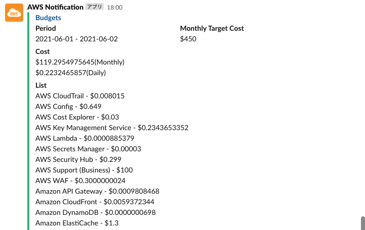
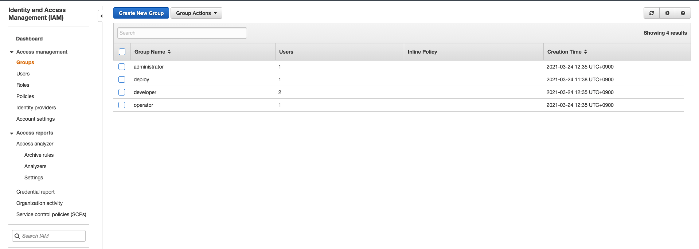

# AWS Base Terraform

## OverView

AWS でインフラを構築する際には、どんなプロジェクトでも必ず考慮すべき事項があります。例えばセキュリティ、IAM、コスト、ログの保存・通知関連等...必ず考慮すべき事項をプロジェクト毎に毎回 Terraform を別々に構築するのは、かなり大変です。  
このリポジトリでは、ベースラインとなる設定を Terraform で構築しています。

## INDEX

- Base
  - [Required](#required)
- Functions
  - Security
    - [CloudTrail](#cloudtrail)
    - [Config](#config)
    - [GuardDuty](#guardduty)
    - [Security Hub](#security-hub)
  - Other
    - [Budgets](#budgets)
    - [IAM group policy](#iam-group-policy)
    - [IAM User and Group](#iam-user-and-group)
    - [Resource Groups](#resource-groups)
    - [Trusted Advisor](#trusted-advisor)
- Settings
  - [Initial setting](#initial-setting)
- Logs
  - [S3 bucket list](#s3-bucket-list)

## Required

- Terraform  
  Terraform コマンドが必要です。  
  https://www.terraform.io/
- Slack  
  通知用として、Slack と OAuthToken と ChannelID が必要です。  
  https://slack.com/  
  https://slack.dev/node-slack-sdk/getting-started

## CloudTrail

AWS CloudTrail は、AWS アカウントのガバナンス、コンプライアンス、運用監査、リスク監査を行うためのサービスです。CloudTrail を使用すると、AWS インフラストラクチャ全体でアカウントアクティビティをログに記録し、継続的に監視し、保持できます。

Slack チャンネルへの設定・Slack アプリの追加を行い、OAuthToken を設定することで、Slack 通知が行われるようになります。  
以下のようなメッセージが通知されます。


## Config

AWS Config は、AWS リソースの設定を評価、監査、審査できるサービスです。Config では、AWS リソースの設定が継続的にモニタリングおよび記録され、望まれる設定に対する記録された設定の評価を自動的に実行できます。Config を使用すると、AWS リソース間の設定や関連性の変更を確認し、詳細なリソース設定履歴を調べ、社内ガイドラインで指定された設定に対する全体的なコンプライアンスを確認できます。これにより、コンプライアンス監査、セキュリティ分析、変更管理、運用上のトラブルシューティングを簡素化できます。

Slack チャンネルへの設定・Slack アプリの追加を行い、OAuthToken を設定することで、Slack 通知が行われるようになります。  
以下のようなメッセージが通知されます。


## GuardDuty

Amazon GuardDuty は、AWS 　のアカウント、ワークロード、および　 Amazon S3 に保存されたデータを保護するために、悪意のあるアクティビティや不正な動作を継続的にモニタリングする脅威検出サービスです。

Slack チャンネルへの設定・Slack アプリの追加を行い、OAuthToken を設定することで、Slack 通知が行われるようになります。  
以下のようなメッセージが通知されます。


## Security Hub

AWS Security Hub では、セキュリティアラートとセキュリティ状況を、すべての AWS アカウントで包括的に確認できます。ファイアウォールとエンドポイントの保護から脆弱性とコンプライアンスに対するスキャナーに至るまで、幅広い高機能なセキュリティツールを自由に利用できます。

Security Hub で提供されている Security standards の 3 つのセキュリティを可能な限り対応したものです。

- AWS Foundational Security Best Practices
- CIS AWS Foundations Benchmark
- PCI DSS v3.2.1

以下の内容は、本 Terraform のみを適用した場合の Security score です。  
`構築後は、再評価しないと正確なスコアが出ないことを認識する必要があります。`


## Budgets

AWS Budgets には、カスタム予算を設定して、コストまたは使用量が予算額や予算量を超えたとき (あるいは、超えると予測されたとき) にアラートを発信できる機能が用意されています。

Slack チャンネルへの設定・Slack アプリの追加を行い、OAuthToken を設定することで、指定の時間（デフォルトは毎日 18:00JST）に Slack 通知が届くようになります。また、指定したコストリミットを超える場合はメールが送信されます。



## Compute Optimizer

AWS Compute Optimizer はワークロードに最適な AWS リソースを推奨し、機械学習を使って過去の使用率メトリクスを分析することで、コストを削減し、パフォーマンスを向上します。リソースを過剰にプロビジョニングすると不要なインフラストラクチャのコストを招く可能性があります。一方、リソースのプロビジョニング不足だとアプリケーションのパフォーマンスが低下する可能性があります。Compute Optimizer は、使用率データに基づいて、Amazon EC2 インスタンス、Amazon EBS ボリューム、AWS Lambda 関数の 3 種類の AWS リソースに最適な構成を選択する場合に役に立ちます。

## IAM group policy

IAM グループに割り振るポリシーを設定することができます。またベースのポリシーとして仮想 MFA 設定を必須とすることもできます。


## IAM User and Group

IAM User と Group の作成を行うことができます。




## Resource Groups

全体的に Terraform で作成された resource は全て同一の TAG で、その TAG でフィルタされた Resource Groups が作成されます。


## Trusted Advisor

AWS Trusted Advisor は、AWS のベストプラクティスに従うためのガイダンスを提供するフルマネージドサービスです。AWS インフラストラクチャを最適化するのに役立つ Trusted Advisor にアクセスして、セキュリティとパフォーマンスを向上し、総コストを削減し、サービスの制限をモニタリングします。

Slack チャンネルへの設定・Slack アプリの追加を行い、OAuthToken を設定することで、指定の時間（デフォルトは毎日 9:00JST）に Slack 通知が届くようになります。  
ただし、Trusted Advisor はサポートプランがビジネスプランかエンタープライズプランの契約が必要です。デフォルトでは false となっています。


## Initial setting

- ルートアカウントからアクセスキーを削除  
  セキュリティとして問題があるため、マネージメントコンソールからルートアカウントのアクセスキーを削除しましょう。

- Terraform を実行するための IAM ユーザ and IAM グループのマニュアル作成  
  Terraform を実行するためにマネージメントコンソールから IAM ユーザと IAM グループを作成します。
  IAM グループ(仮名:deploy)を作成します。ポリシーは AdministratorAccess をアタッチします。
  IAM ユーザ(仮名:terraform)を作成します。Access Type は Programmatic access のみ与えます。IAM グループ(仮名:deploy)に追加します。

- Terraform State を保存するための S3 作成  
  Terraform State を管理するためのマネージメントコンソールから S3 を作成します。
  ただし、aws コマンドと profile が設定済みで実行できる環境がある場合は、下記のコマンドを実行すると S3 が作成されます。  
  https://github.com/y-miyazaki/cloud-commands/blob/master/cmd/awstfinitstate

```sh
# awstfinitstate -h

This command creates a S3 Bucket for Terraform State.
You can also add random hash to bucket name suffix.

Usage:
    awstfinitstate -r {region} -b {bucket name} -p {profile}[<options>]
    awstfinitstate -r ap-northeast-1 -b terraform-state
    awstfinitstate -r ap-northeast-1 -b terraform-state -p default -s

Options:
    -b {bucket name}          S3 bucket name
    -p {aws profile name}     Name of AWS profile
    -r {region}               S3 region
    -s                        If set, a random hash will suffix bucket name.
    -h                        Usage awstfinitstate

# awstfinitstate -r ap-northeast-1 -b terraform-state -p default -s
~
~
~
~
~
~
~
~
~
~
~
~
~
--------------------------------------------------------------
bucket_name: terraform-state-xxxxxxxxxx
region: ap-northeast-1
--------------------------------------------------------------
```

- 環境毎に設定する terraform.{environment}.tfvars ファイル  
  リンク先にある[terraform.example.tfvars](terraform/base/terraform.example.tfvars)の名前を変更し、自分の環境用に各変数を変更する必要があります。変更するべき変数には TODO コメントが記載されています。TODO で検索してください。

- 環境毎に設定する main_provider.tf ファイル  
  リンク先にある[main_provider.tf.example](terraform/base/main_provider.tf.example)を main_provider.tf にリネームししてください。その後、各パラメータを変更する必要があります。変更するべき変数には TODO コメントが記載されています。TODO で検索してください。

```terraform
#--------------------------------------------------------------
# Terraform Provider
#--------------------------------------------------------------
terraform {
  required_version = ">=0.13"
  required_providers {
    aws = {
      source  = "hashicorp/aws"
      version = ">=3.29.1"
    }
  }
  backend "s3" {
    # TODO: need to change bucket for terraform state.
    bucket = "xxxxxxxxxxxxxxxx"
    # TODO: need to change bucket key for terraform state.
    key = "xxxxxxxxxx"
    # TODO: need to change profile for terraform state.
    profile = "default"
    # TODO: need to change region for terraform state.
    region = "ap-northeast-1"
  }
}

#--------------------------------------------------------------
# AWS Provider
# access key and secret key should not use.
#--------------------------------------------------------------
provider "aws" {
  # TODO: need to change profile.
  profile = "default"
  # TODO: need to change region.
  region = "ap-northeast-1"
}
```

- Terraform の実行  
  terraform コマンドで実行します。terraform init 後に terraform apply を行います。
  もしかすると terraform apply が失敗するかもしれませんが、conflict などの問題で失敗する場合があるので再度実行すれば成功します。

```sh
bash-5.1# terraform init
There are some problems with the CLI configuration:

Error: The specified plugin cache dir /root/.terraform.d/plugin-cache cannot be opened: stat /root/.terraform.d/plugin-cache: no such file or directory


As a result of the above problems, Terraform may not behave as intended.


Initializing modules...

Initializing the backend...

Initializing provider plugins...
- Reusing previous version of hashicorp/aws from the dependency lock file
- Reusing previous version of hashicorp/random from the dependency lock file
- Reusing previous version of hashicorp/template from the dependency lock file
- Installing hashicorp/aws v3.29.1...
- Installed hashicorp/aws v3.29.1 (signed by HashiCorp)
- Installing hashicorp/random v3.1.0...
- Installed hashicorp/random v3.1.0 (signed by HashiCorp)
- Installing hashicorp/template v2.2.0...
- Installed hashicorp/template v2.2.0 (signed by HashiCorp)

Terraform has been successfully initialized!

You may now begin working with Terraform. Try running "terraform plan" to see
any changes that are required for your infrastructure. All Terraform commands
should now work.

If you ever set or change modules or backend configuration for Terraform,
rerun this command to reinitialize your working directory. If you forget, other
commands will detect it and remind you to do so if necessary.
```

```sh
bash-5.1# terraform apply --auto-approve -var-file=terraform.example.tfvars
module.aws_recipes_s3_bucket_log_logging.random_id.this: Creating...
random_id.this: Creating...
module.aws_recipes_s3_bucket_log_logging.random_id.this: Creation complete after 0s [id=wiatHg]
random_id.this: Creation complete after 0s [id=uqe0bU7J]
module.aws_recipes_security_default_vpc.aws_default_subnet.this[1]: Creating...

...
...
...

Apply complete! resources: x added, x changed, 0 destroyed.
```

## S3 bucket list

作成される S3 Bucket と Bucket 内にあるデータの説明です。

| Category       | bucket                  | Directory                                                       | Description                                                                                                                                                                                                                                                                                                                                                                                                                                           | Note                                                                                                                 |
| :------------- | :---------------------- | :-------------------------------------------------------------- | :---------------------------------------------------------------------------------------------------------------------------------------------------------------------------------------------------------------------------------------------------------------------------------------------------------------------------------------------------------------------------------------------------------------------------------------------------- | :------------------------------------------------------------------------------------------------------------------- |
| AWS Config     | aws-config              | /AWSLogs/{accountID}/Config/{region}/yyyy/m/d/ConfigHistory/    | AWS Config Compliance History Timeline for Resources.                                                                                                                                                                                                                                                                                                                                                                                                 | https://docs.aws.amazon.com/config/latest/developerguide/view-compliance-history.html                                |
| AWS Config     | aws-config              | /AWSLogs/{accountID}/Config/{region}/yyyy/m/d/ConfigSnapshot/   | AWS Config snapshot.                                                                                                                                                                                                                                                                                                                                                                                                                                  | https://docs.aws.amazon.com/config/latest/developerguide/deliver-snapshot-cli.html                                   |
| AWS Config     | aws-config              | /AWSLogs/{accountID}/Config/ConfigWritabilityCheckFile/yyyy/m/d | This is a test file to confirm that Config can be written to the S3 bucket normally.                                                                                                                                                                                                                                                                                                                                                                  |                                                                                                                      |
| AWS CloudTrail | aws-cloudtrail          | /AWSLogs/{accountID}/CloudTrail-Digest/{region}/yyyy/mm/dd      | Each digest file contains the names of the log files that were delivered to your Amazon S3 bucket during the last hour, the hash values for those log files, and the digital signature of the previous digest file. The signature for the current digest file is stored in the metadata properties of the digest file object. The digital signatures and hashes are used for validating the integrity of the log files and of the digest file itself. | https://docs.aws.amazon.com/awscloudtrail/latest/userguide/cloudtrail-log-file-validation-digest-file-structure.html |
| AWS CloudTrail | aws-cloudtrail          | /AWSLogs/{accountID}/CloudTrail-Insight/{region}/yyyy/mm/dd     | CloudTrail Insights can help you detect unusual API activity in your AWS account by raising Insights events. CloudTrail Insights measures your normal patterns of API call volume, also called the baseline, and generates Insights events when the volume is outside normal patterns. Insights events are generated for write management APIs.                                                                                                       | https://docs.aws.amazon.com/awscloudtrail/latest/userguide/logging-insights-events-with-cloudtrail.html              |
| AWS CloudTrail | aws-cloudtrail          | /AWSLogs/{accountID}/CloudTrail/{region}/yyyy/mm/dd             | It is recorded as an event in CloudTrail. Events include actions taken in the AWS Management Console, AWS Command Line Interface.                                                                                                                                                                                                                                                                                                                     | https://docs.aws.amazon.com/awscloudtrail/latest/userguide/get-and-view-cloudtrail-log-files.html                    |
| AWS Log        | aws-logging             | /CloudTrail                                                     | S3 bucket access log for CloudTrail bucket.                                                                                                                                                                                                                                                                                                                                                                                                           | https://docs.aws.amazon.com/ja_jp/AmazonS3/latest/userguide/ServerLogs.html                                          |
| AWS Log        | aws-logging-application | /Application                                                    | Application log from CloudWatch Logs.                                                                                                                                                                                                                                                                                                                                                                                                                 |                                                                                                                      |

## Author Information

Author: Yoshiaki Miyazaki  
Contact: https://github.com/y-miyazaki
