<!-- omit in toc -->
# AWS Base Terraform

<!-- omit in toc -->
# OverView

When building infrastructure in AWS, there are always things to consider for any project. For example, security, IAM, cost, log storage and notification, etc... It is quite difficult to build a separate Terraform for each project for all the things that must be considered.  
In this repository, we use Terraform to build the baseline configuration.

The directory is divided into two parts, [base](./terraform/base) and [monitor](./terraform/monitor), each of which has different corresponding functions. For details, please refer to the description of each part.

Basically, it is designed to be turned on and off for each setting and function by simply modifying terraform.example.tfvars in each function. Please check the link below for an explanation.

- base  
  [terraform/base/terraform.example.tfvars](./terraform/base/terraform.example.tfvars)  
  Document: [README-base-tfvars.md](./README-base-tfvars.md)

- monitor  
  [terraform/monitor/terraform.example.tfvars](./terraform/monitor/terraform.example.tfvars)  
  Document: [README-monitor-tfvars.md](./README-monitor-tfvars.md)

<!-- omit in toc -->
# Table of Contents
- [Required](#required)
- [Architecture](#architecture)
- [Functions](#functions)
- [Base](#base)
  - [Security](#security)
    - [Security:CloudTrail](#securitycloudtrail)
    - [Security:Config](#securityconfig)
    - [Security:GuardDuty](#securityguardduty)
    - [Security:Security Hub](#securitysecurity-hub)
  - [Other](#other)
    - [Other:Budgets](#otherbudgets)
    - [Other:Compute Optimizer](#othercompute-optimizer)
    - [Other:IAM group policy](#otheriam-group-policy)
    - [Other:IAM User and Group](#otheriam-user-and-group)
    - [Other:Resource Groups](#otherresource-groups)
    - [Other:Trusted Advisor](#othertrusted-advisor)
- [Monitor](#monitor)
  - [Log](#log)
    - [Log:Application](#logapplication)
    - [Log:Postgres](#logpostgres)
  - [Metrics](#metrics)
    - [Metrics:ALB](#metricsalb)
    - [Metrics:API Gateway](#metricsapi-gateway)
    - [Metrics:CloudFront](#metricscloudfront)
    - [Metrics:EC2](#metricsec2)
    - [Metrics:ElastiCache](#metricselasticache)
    - [Metrics:Lambda](#metricslambda)
    - [Metrics:RDS](#metricsrds)
    - [Metrics:SES](#metricsses)
    - [Metrics:Synthetics Canary](#metricssynthetics-canary)
  - [CloudWatch Events(EventBridge)](#cloudwatch-eventseventbridge)
    - [CloudWatch Events:EC2](#cloudwatch-eventsec2)
  - [Athena](#athena)
    - [Athena: Named Query](#athena-named-query)
    - [Athena: CloudFront](#athena-cloudfront)
    - [Athena: SES](#athena-ses)
  - [S3 bucket list](#s3-bucket-list)
  - [Author Information](#author-information)

# Required

- Terraform  
  https://www.terraform.io/
- Slack  
  For notifications, you will need Slack, OAuthToken, and ChannelID.  
  https://slack.com/  
  https://slack.dev/node-slack-sdk/getting-started

# Architecture

The architecture when all elements are supported is shown below. Each resource can be included or removed depending on the infrastructure configuration.

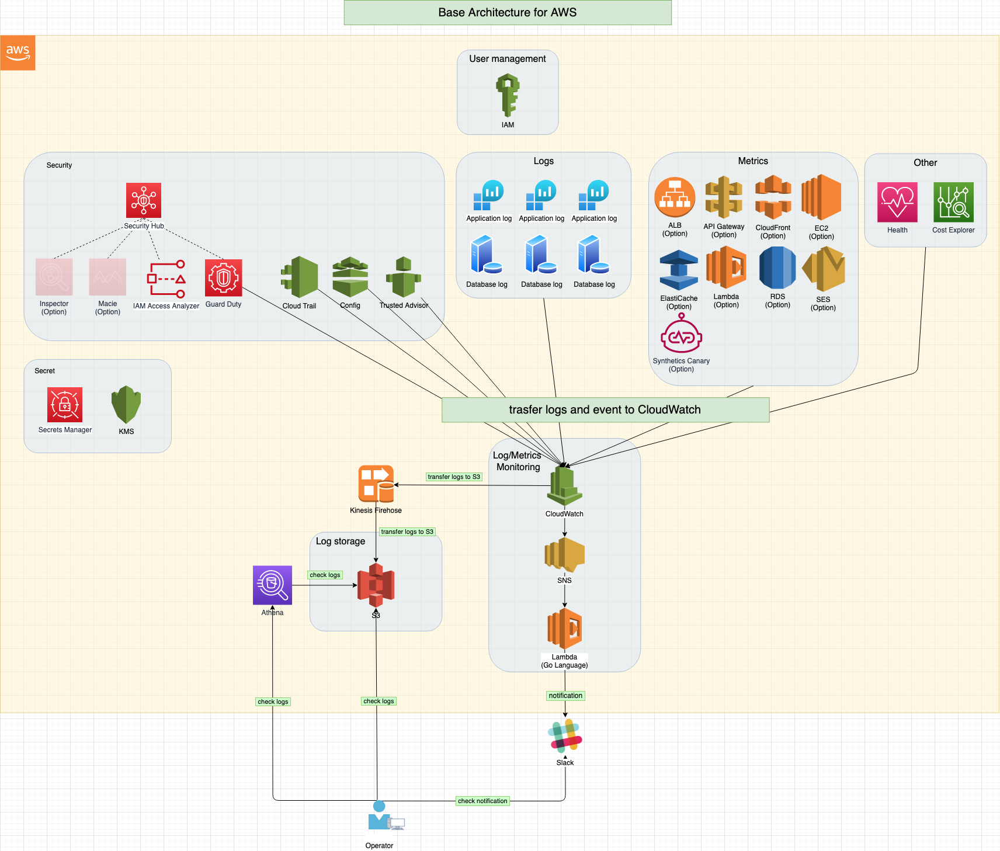

# Functions

# Base

This is a description of [Terraform's Base](./terraform/base/). The following contents provide an overview of each function.

## Security

### Security:CloudTrail

AWS CloudTrail is a service for governance, compliance, operational and risk auditing of AWS accounts.CloudTrail enables you to log, continuously monitor and retain account activity across your AWS infrastructure.

After configuring the Slack channel, adding the Slack app, and setting the OAuthToken, Slack notifications will be sent.  
You will be notified with a message similar to the following.

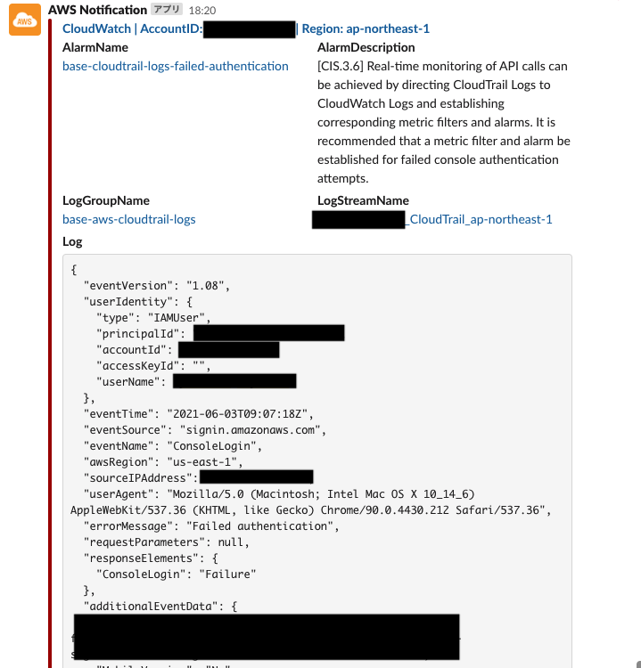

### Security:Config

AWS Config is a service that allows you to evaluate, audit, and review the configuration of AWS resources. Config continuously monitors and records the configuration of AWS resources and automatically evaluates the recorded configuration against the desired settings. Config allows you to review configuration and association changes between AWS resources, examine detailed resource configuration history, and verify overall compliance with settings specified in company guidelines. This simplifies compliance audits, security analysis, change management, and operational troubleshooting.

After configuring the Slack channel, adding the Slack app, and setting the OAuthToken, Slack notifications will be sent.  
You will be notified with a message similar to the following.

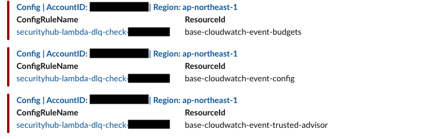

### Security:GuardDuty

Amazon GuardDuty is a threat detection service that continuously monitors for malicious or unauthorized activity in order to protect AWS accounts, workloads, and data stored in Amazon S3.

After configuring the Slack channel, adding the Slack app, and setting the OAuthToken, Slack notifications will be sent.  
You will be notified with a message similar to the following.

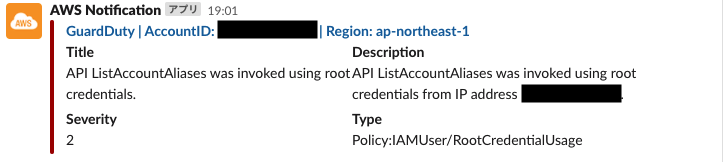

### Security:Security Hub

The AWS Security Hub provides a comprehensive view of security alerts and security status across all your AWS accounts. A wide range of sophisticated security tools are at your disposal, from firewall and endpoint protection to vulnerability and compliance scanners.

The three security standards provided in the Security Hub are addressed to the best of our ability.

- AWS Foundational Security Best Practices
- CIS AWS Foundations Benchmark
- PCI DSS v3.2.1

The following is the security score when only this Terraform is applied.  
`You should be aware that the score will not be accurate until you re-evaluate it after building. `

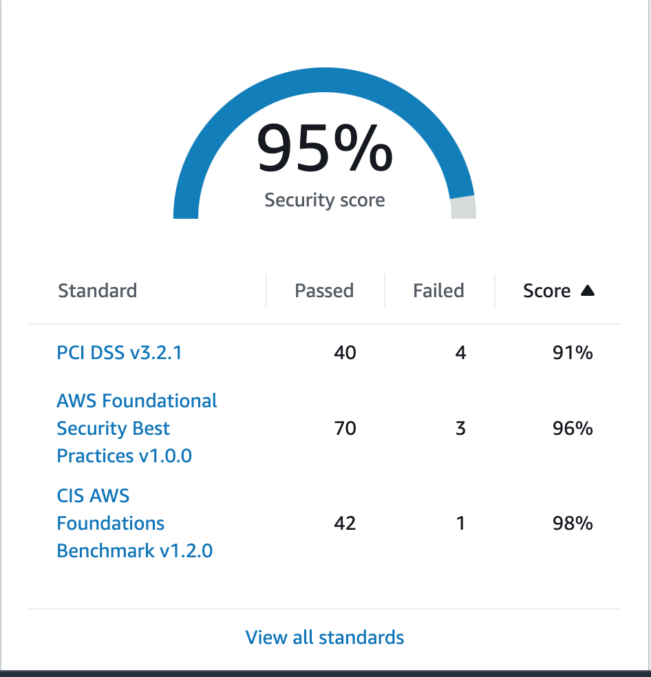

## Other

### Other:Budgets

AWS Budgets provides the ability to set up custom budgets and be alerted when costs or usage exceed (or are expected to exceed) the budgeted amount or amounts.

After configuring the Slack channel, adding the Slack app, and setting the OAuthToken, you will receive Slack notifications at the specified time (default is 18:00 JST daily). An email will also be sent if the specified cost limit is exceeded.

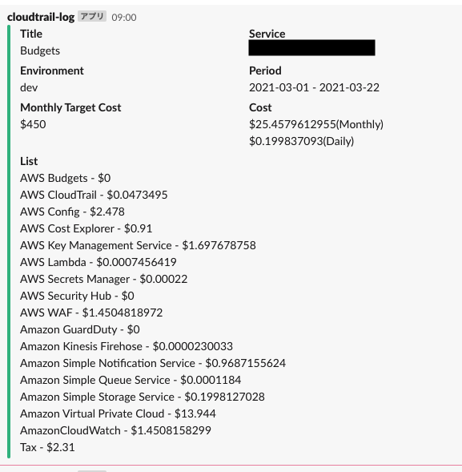

### Other:Compute Optimizer

AWS Compute Optimizer recommends optimal AWS resources for your workloads to reduce costs and improve performance by using machine learning to analyze historical utilization metrics. Over-provisioning resources can lead to unnecessary infrastructure cost, and under-provisioning resources can lead to poor application performance. Compute Optimizer helps you choose optimal configurations for three types of AWS resources: Amazon EC2 instances, Amazon EBS volumes, and AWS Lambda functions, based on your utilization data.

### Other:IAM group policy

You can set the policy to assign to IAM groups. You can also make the virtual MFA setting mandatory as a base policy.  
You can also configure the IAM Switch Role.

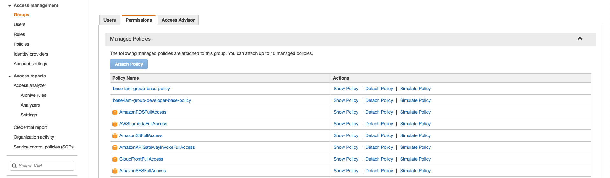

### Other:IAM User and Group

You can create an IAM User and Group.

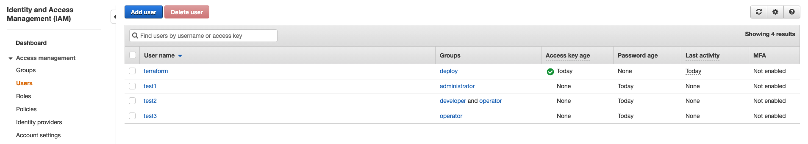
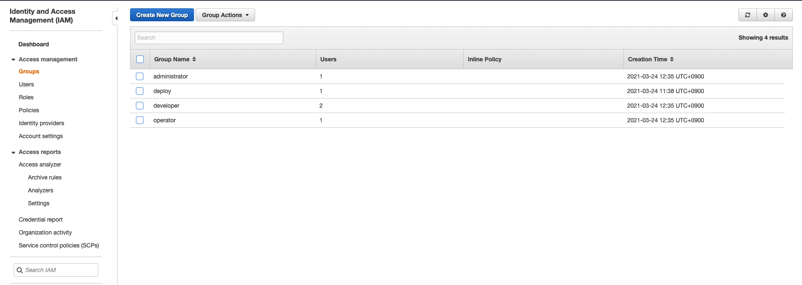

### Other:Resource Groups

Overall, all resources created in Terraform will have the same TAG, and Resource Groups will be filtered by that TAG.

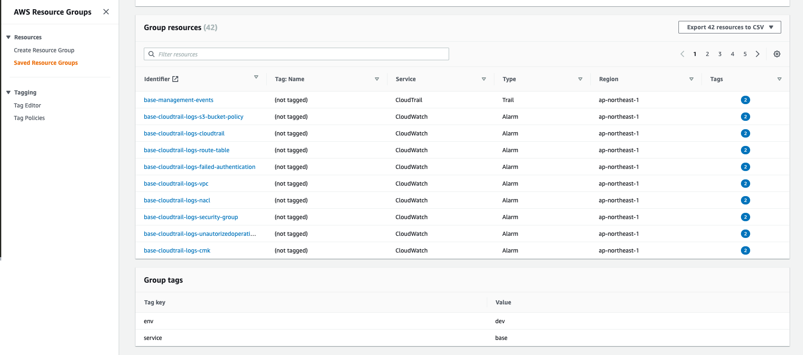

### Other:Trusted Advisor

AWS Trusted Advisor is a fully managed service that provides guidance on how to follow AWS best practices. Improve security and performance, reduce costs, and monitor service limitations.

After configuring the Slack channel, adding the Slack app, and setting the OAuthToken, you will be able to receive Slack notifications at the specified time (default is 9:00 JST daily).  
However, Trusted Advisor requires the support plan to be signed up for the Business or Enterprise plan. The default setting is false.

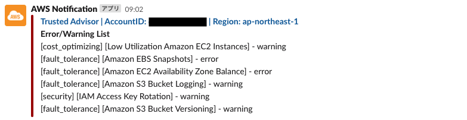

# Monitor

This is a description of [Terraform's Monitor](./terraform/monitor/). The following contents provide an overview of each function.

## Log

You can use Amazon CloudWatch Logs to monitor, store, and access your log files from Amazon Elastic Compute Cloud (Amazon EC2) instances, AWS CloudTrail, Route 53, and other sources.

CloudWatch Logs enables you to centralize the logs from all of your systems, applications, and AWS services that you use, in a single, highly scalable service. You can then easily view them, search them for specific error codes or patterns, filter them based on specific fields, or archive them securely for future analysis. CloudWatch Logs enables you to see all of your logs, regardless of their source, as a single and consistent flow of events ordered by time, and you can query them and sort them based on other dimensions, group them by specific fields, create custom computations with a powerful query language, and visualize log data in dashboards.

Reference: [What is Amazon CloudWatch Logs?](https://docs.aws.amazon.com/AmazonCloudWatch/latest/logs/WhatIsCloudWatchLogs.html)

### Log:Application

The filter function of CloudWatchLogs can be used to check specified logs with specified filter patterns. Those that hit the filter pattern will be notified by Slack via Lambda.

### Log:Postgres

The filter function of CloudWatchLogs can be used to check specified logs with specified filter patterns. Those that hit the filter pattern will be notified by Slack via Lambda.

## Metrics

Metrics are data about the performance of your systems. By default, many services provide free metrics for resources (such as Amazon EC2 instances, Amazon EBS volumes, and Amazon RDS DB instances). You can also enable detailed monitoring for some resources, such as your Amazon EC2 instances, or publish your own application metrics. Amazon CloudWatch can load all the metrics in your account (both AWS resource metrics and application metrics that you provide) for search, graphing, and alarms.

Reference: [Using Amazon CloudWatch metrics](https://docs.aws.amazon.com/AmazonCloudWatch/latest/monitoring/working_with_metrics.html)

### Metrics:ALB

Metrics about ALB will be checked and you will be notified via Slack if the specified threshold is exceeded.

Reference: [CloudWatch metrics for your Application Load Balancer](https://docs.aws.amazon.com/elasticloadbalancing/latest/application/load-balancer-cloudwatch-metrics.html)

### Metrics:API Gateway

Metrics about API Gateway will be checked and you will be notified via Slack if the specified threshold is exceeded.

Reference: [Amazon API Gateway dimensions and metrics](https://docs.aws.amazon.com/apigateway/latest/developerguide/api-gateway-metrics-and-dimensions.html)

### Metrics:CloudFront

Metrics about CloudFront will be checked and you will be notified via Slack if the specified threshold is exceeded.

Reference: [Monitoring CloudFront metrics with Amazon CloudWatch](https://docs.aws.amazon.com/AmazonCloudFront/latest/DeveloperGuide/monitoring-using-cloudwatch.html)

### Metrics:EC2

Metrics about EC2 will be checked and you will be notified via Slack if the specified threshold is exceeded.  
  
Reference: [Monitoring use with CloudWatch Metrics](https://docs.aws.amazon.com/AWSEC2/latest/UserGuide/viewing_metrics_with_cloudwatch.html)

### Metrics:ElastiCache

Metrics about ElastiCache will be checked and you will be notified via Slack if the specified threshold is exceeded.  
  
Reference: [Monitoring use with CloudWatch Metrics](https://docs.aws.amazon.com/AmazonElastiCache/latest/red-ug/CacheMetrics.html)

### Metrics:Lambda

Metrics about Lambda will be checked and you will be notified via Slack if the specified threshold is exceeded.  
  
Reference: [Working with Lambda function metrics](https://docs.aws.amazon.com/lambda/latest/dg/monitoring-metrics.html)

### Metrics:RDS

Metrics about RDS will be checked and you will be notified via Slack if the specified threshold is exceeded.  
  
Reference: [Monitoring Amazon RDS metrics with Amazon CloudWatch](https://docs.aws.amazon.com/AmazonRDS/latest/UserGuide/monitoring-cloudwatch.html)

### Metrics:SES

Metrics about SES will be checked and you will be notified via Slack if the specified threshold is exceeded.  
  
Reference: [Retrieving Amazon SES event data from CloudWatch](https://docs.aws.amazon.com/ses/latest/dg/event-publishing-retrieving-cloudwatch.html)

### Metrics:Synthetics Canary

You can use Amazon CloudWatch Synthetics to create canaries, configurable scripts that run on a schedule, to monitor your endpoints and APIs. Canaries follow the same routes and perform the same actions as a customer, which makes it possible for you to continually verify your customer experience even when you don't have any customer traffic on your applications. By using canaries, you can discover issues before your customers do.

Using Synthetics Canary, the status code is checked against the specified URL,
and if an unexpected status code is returned, the user is notified via Slack.  
  
Reference: [Using synthetic monitoring](https://docs.aws.amazon.com/AmazonCloudWatch/latest/monitoring/CloudWatch_Synthetics_Canaries.html)

## CloudWatch Events(EventBridge)

Amazon EventBridge is a serverless event bus service that you can use to connect your applications with data from a variety of sources. EventBridge delivers a stream of real-time data from your applications, software as a service (SaaS) applications, and AWS services to targets such as AWS Lambda functions, HTTP invocation endpoints using API destinations, or event buses in other AWS accounts.

Reference: [What Is Amazon EventBridge?](https://docs.aws.amazon.com/eventbridge/latest/userguide/eb-what-is.html)

### CloudWatch Events:EC2

The following events are monitored.

- EC2 Instance Rebalance Recommendation  
  https://docs.aws.amazon.com/AWSEC2/latest/UserGuide/rebalance-recommendations.html
- EC2 Spot Instance Interruption Warning  
  https://docs.aws.amazon.com/AWSEC2/latest/UserGuide/spot-instance-termination-notices.html

## Athena

Amazon Athena is an interactive query service that makes it easy to analyze data directly in Amazon Simple Storage Service (Amazon S3) using standard SQL. With a few actions in the AWS Management Console, you can point Athena at your data stored in Amazon S3 and begin using standard SQL to run ad-hoc queries and get results in seconds.  
Reference: [What is Amazon Athena?](https://docs.aws.amazon.com/athena/latest/ug/what-is.html)  

### Athena: Named Query
Named Query (Named Query, Saved Query) is an Amazon Athena feature that allows you to name and save SQL queries and call them from the console.

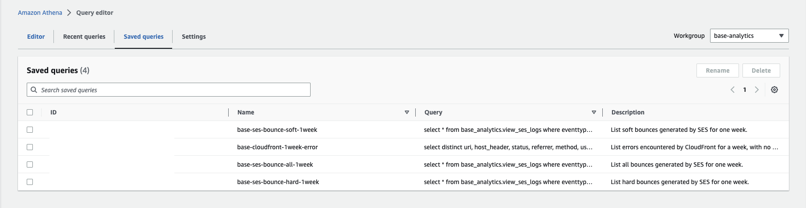
### Athena: CloudFront
If you are using CloudFront to store your standard logs in S3, you can retrieve the logs from Athena using SQL.  
When the Athena function is enabled, a table is created for CloudFront and a named query is created for easy searching.  

Reference: [Configuring and using standard logs (access logs)](https://docs.aws.amazon.com/AmazonCloudFront/latest/DeveloperGuide/AccessLogs.html)

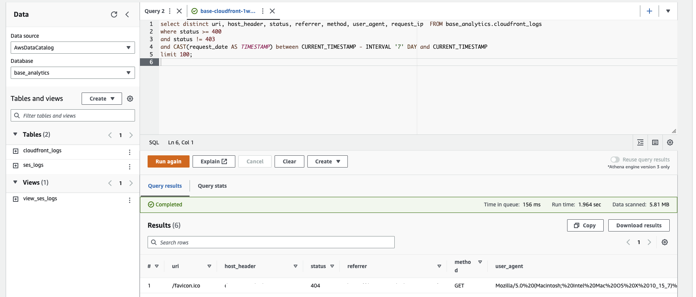

### Athena: SES
If you are using SES to store your standard logs in S3, you can retrieve the logs from Athena using SQL.  
When the Athena function is enabled, a table is created for SES and a named query is created for easy searching.  

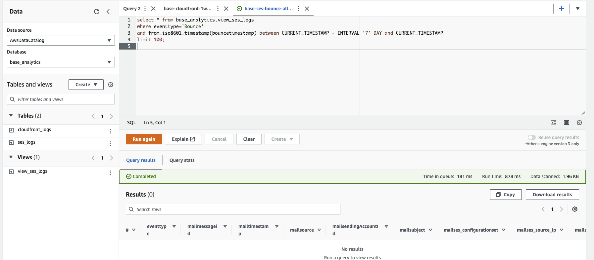

## S3 bucket list

This is a description of the S3 bucket that will be created and the data in the bucket.

| Category       | bucket                          | Directory                                                       | Description                                                                                                                                                                                                                                                                                                                                                                                                                                           | Note                                                                                                                 |
| :------------- | :------------------------------ | :-------------------------------------------------------------- | :---------------------------------------------------------------------------------------------------------------------------------------------------------------------------------------------------------------------------------------------------------------------------------------------------------------------------------------------------------------------------------------------------------------------------------------------------- | :------------------------------------------------------------------------------------------------------------------- |
| AWS Config     | aws-log-common-{random id}      | /AWSLogs/{accountID}/Config/{region}/yyyy/m/d/ConfigHistory/    | AWS Config Compliance History Timeline for Resources.                                                                                                                                                                                                                                                                                                                                                                                                 | https://docs.aws.amazon.com/config/latest/developerguide/view-compliance-history.html                                |
| AWS Config     | aws-log-common-{random id}      | /AWSLogs/{accountID}/Config/{region}/yyyy/m/d/ConfigSnapshot/   | AWS Config snapshot.                                                                                                                                                                                                                                                                                                                                                                                                                                  | https://docs.aws.amazon.com/config/latest/developerguide/deliver-snapshot-cli.html                                   |
| AWS Config     | aws-log-common-{random id}      | /AWSLogs/{accountID}/Config/ConfigWritabilityCheckFile/yyyy/m/d | This is a test file to confirm that Config can be written to the S3 bucket normally.                                                                                                                                                                                                                                                                                                                                                                  |                                                                                                                      |
| AWS Config     | aws-log-common-{random id}      | /AWSLogs/{accountID}/CloudTrail/AccessLog                       | This is the access log of the CloudTrail bucket.                                                                                                                                                                                                                                                                                                                                                                                                      |
| AWS CloudTrail | aws-log-cloudtrail-{random id}  | /AWSLogs/{accountID}/CloudTrail-Digest/{region}/yyyy/mm/dd      | Each digest file contains the names of the log files that were delivered to your Amazon S3 bucket during the last hour, the hash values for those log files, and the digital signature of the previous digest file. The signature for the current digest file is stored in the metadata properties of the digest file object. The digital signatures and hashes are used for validating the integrity of the log files and of the digest file itself. | https://docs.aws.amazon.com/awscloudtrail/latest/userguide/cloudtrail-log-file-validation-digest-file-structure.html |
| AWS CloudTrail | aws-log-cloudtrail-{random id}  | /AWSLogs/{accountID}/CloudTrail-Insight/{region}/yyyy/mm/dd     | CloudTrail Insights can help you detect unusual API activity in your AWS account by raising Insights events. CloudTrail Insights measures your normal patterns of API call volume, also called the baseline, and generates Insights events when the volume is outside normal patterns. Insights events are generated for write management APIs.                                                                                                       | https://docs.aws.amazon.com/awscloudtrail/latest/userguide/log-insights-events-with-cloudtrail.html                  |
| AWS CloudTrail | aws-log-cloudtrail-{random id}  | /AWSLogs/{accountID}/CloudTrail/{region}/yyyy/mm/dd             | It is recorded as an event in CloudTrail. Events include actions taken in the AWS Management Console, AWS Command Line Interface.                                                                                                                                                                                                                                                                                                                     | https://docs.aws.amazon.com/awscloudtrail/latest/userguide/get-and-view-cloudtrail-log-files.html                    |
| AWS Log        | aws-log-application-{random id} | /Logs                                                           | Application log from CloudWatch Logs.                                                                                                                                                                                                                                                                                                                                                                                                                 |                                                                                                                      |

## Author Information

Author: Yoshiaki Miyazaki  
Contact: https://github.com/y-miyazaki
