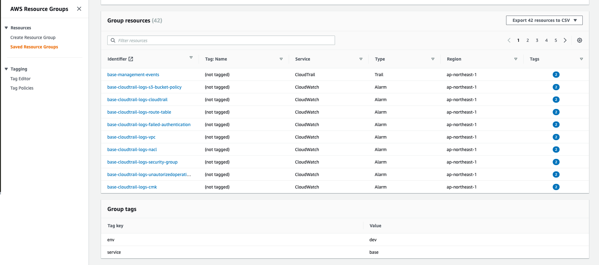

# AWS 初期設定用 Terraform

`!!!!!!!!!!WORK IN PROGRESS!!!!!!!!!!`

## OverView

AWS でインフラを構築する際には、どんなプロジェクトでも必ず考慮すべき事項があります。
例えばセキュリティ、IAM、コスト、ログの保存・通知関連等...
必ず考慮すべき事項をプロジェクト毎に毎回 Terraform を別々に構築するのは、かなり大変です。
このリポジトリでは、基本的に設定した方が良い項目を対応したものです。

## INDEX

-   [AWS Security Hub でのセキュリティ対応](#aws-security-hub-でのセキュリティ対応)
-   [IAM ユーザ・グループの作成](#iam-ユーザ・グループの作成)
-   [IAM グループへのポリシーの設定](#iam-グループへのポリシーの設定)
-   [CloudTrail によるセキュリティ面での Slack 通知](#cloudtrail-によるセキュリティ面での-Slack-通知)
-   [GuardDuty によるセキュリティ面での Slack 通知](#guardduty-によるセキュリティ面での-slack-通知)
-   [Cost Management での Budgets のアラート設定・Slack 通知](#cost-management-での-budgets-のアラート設定・slack-通知)
-   [Trusted Advisor での Slack 通知](#trusted-advisor-での-slack-通知)
-   [CloudWatch 上にあるログの Slack 通知](#cloudWatch-上にあるログの-slack-通知)
-   [初期設定](#初期設定)

## AWS Security Hub でのセキュリティ対応

AWS Security Hub で提供されている Security standards の 3 つのセキュリティを可能な限り対応したものです。

-   AWS Foundational Security Best Practices
-   CIS AWS Foundations Benchmark
-   PCI DSS v3.2.1

以下の内容は、本 Terraform のみを適用した場合の Security score です。
`構築後すぐに正確なスコアが出ないことを認識する必要があります。`


## 本 Terraform のリソース一式を管理する ResourceGroup の作成

全体的に Terraform で作成された Resource は全て同一の TAG で、その TAG でフィルタされた ResourceGroup が作成されます。



## IAM ユーザ・グループの作成

IAM ユーザ・グループ(例では、administrator/developer/operator)の作成を行うことができます。
terraform ユーザと deploy グループは、[マニュアル](#Terraform-を実行するための-iam-ユーザ-and-iam-グループのマニュアル作成)
で作成されたものです。


## IAM グループへのポリシーの設定

IAM グループに割り振るポリシーを設定することができます。またベースのポリシーとして仮想 MFA 設定が必須となっているため IAM ユーザでログインした後には必ず MFA の設定が必要になります。


## CloudTrail によるセキュリティ面での Slack 通知

Slack チャンネルへの設定・Slack アプリの追加を行い、Token を設定することで、もし CloudTrail 上で問題がある場合は Slack 通知が行われるようになります。以下のようなメッセージが通知されます。


## GuardDuty によるセキュリティ面での Slack 通知

Slack チャンネルへの設定・Slack アプリの追加を行い、Token を設定することで、もし GuardDuty 上で問題がある場合は Slack 通知が行われるようになります。以下のようなメッセージが通知されます。


## Cost Management での Budgets のアラート設定・Slack 通知

Slack チャンネルへの設定・Slack アプリの追加を行い、Token を設定することで、指定の時間（デフォルトは毎日 9:00JST）に Slack 通知が届くようになります。また、指定したコストリミットを超える場合はメールが送信されます。


## CloudWatch 上にあるログの Slack 通知

Slack チャンネルへの設定・Slack アプリの追加を行い、Token を設定することで、指定したロググループのフィルタ条件に一致した内容が Slack 通知で届くようになります。

## Trusted Advisor での Slack 通知

Slack チャンネルへの設定・Slack アプリの追加を行い、Token を設定することで、指定の時間（デフォルトは毎日 9:00JST）に Slack 通知が届くようになります。
ただし、Trusted Advisor はサポートプランがビジネスプランかエンタープライズプランの契約が必要です。デフォルトでは false となっています。

## 初期設定

-   ルートアカウントからアクセスキーをマニュアル削除  
    セキュリティとして問題があるため、マネージメントコンソールからルートアカウントのアクセスキーを削除しましょう。
-   Terraform を実行するための IAM ユーザ and IAM グループのマニュアル作成  
    Terraform を実行するためにマネージメントコンソールから IAM ユーザと IAM グループを作成します。
    IAM グループ(仮名:deploy)を作成します。ポリシーは AdministratorAccess をアタッチします。
    IAM ユーザ(仮名:terraform)を作成します。Access Type は Programmatic access のみ与えます。IAM グループ(仮名:deploy)に追加します。

-   Terraform State を保存するための S3 作成  
    Terraform State を管理するためのマネージメントコンソールから S3 を作成します。
    ただし、aws コマンドと profile が設定済みで実行できる環境がある場合は、下記のコマンドを実行すると S3 が作成されます。  
    https://github.com/y-miyazaki/cloud-commands/blob/master/cmd/awstfinitstate

```sh
# awstfinitstate -h

This command creates a S3 Bucket for Terraform State.
You can also add random hash to bucket name suffix.

Usage:
    awstfinitstate -r {region} -b {bucket name} -p {profile}[<options>]
    awstfinitstate -r ap-northeast-1 -b terraform-state
    awstfinitstate -r ap-northeast-1 -b terraform-state -p default -s

Options:
    -b {bucket name}          S3 bucket name
    -p {aws profile name}     Name of AWS profile
    -r {region}               S3 region
    -s                        If set, a random hash will suffix bucket name.
    -h                        Usage awstfinitstate

# awstfinitstate -r ap-northeast-1 -b terraform-state -p default -s
~
~
~
~
~
~
~
~
~
~
~
~
~
--------------------------------------------------------------
bucket_name: terraform-state-xxxxxxxxxx
region: ap-northeast-1
--------------------------------------------------------------
```

-   環境毎に設定する terraform.{environment}.tfvars ファイル  
    リンク先にある[terraform.example.tfvars](terraform/terraform.example.tfvars)の名前を変更し、自分の環境用に各変数を変更する必要があります。変更するべき変数には TODO コメントが記載されています。TODO で検索してください。

-   環境毎に設定する main_provider.tf ファイル  
    リンク先にある[main_provider.tf.example](terraform/main_provider.tf.example)を main_provider.tf にリネームししてください。その後、各パラメータを変更する必要があります。変更するべき変数には TODO コメントが記載されています。TODO で検索してください。

```terraform
#--------------------------------------------------------------
# Terraform Provider
#--------------------------------------------------------------
terraform {
  required_version = ">=0.13"
  required_providers {
    aws = {
      source  = "hashicorp/aws"
      version = ">=3.29.1"
    }
  }
  backend "s3" {
    # TODO: need to change bucket for terraform state.
    bucket = "xxxxxxxxxxxxxxxx"
    # TODO: need to change bucket key for terraform state.
    key = "xxxxxxxxxx"
    # TODO: need to change profile for terraform state.
    profile = "default"
    # TODO: need to change region for terraform state.
    region = "ap-northeast-1"
  }
}

#--------------------------------------------------------------
# AWS Provider
# access key and secret key should not use.
#--------------------------------------------------------------
provider "aws" {
  # TODO: need to change profile.
  profile = "default"
  # TODO: need to change region.
  region = "ap-northeast-1"
}
```

-   Terraform の実行  
    terraform コマンドで実行します。terraform init 後に terraform apply を行います。
    もしかすると terraform apply が失敗するかもしれませんが、conflict などの問題で失敗する場合があるので再度実行すれば成功します。

```sh
bash-5.1# terraform init
There are some problems with the CLI configuration:

Error: The specified plugin cache dir /root/.terraform.d/plugin-cache cannot be opened: stat /root/.terraform.d/plugin-cache: no such file or directory


As a result of the above problems, Terraform may not behave as intended.


Initializing modules...

Initializing the backend...

Initializing provider plugins...
- Reusing previous version of hashicorp/aws from the dependency lock file
- Reusing previous version of hashicorp/random from the dependency lock file
- Reusing previous version of hashicorp/template from the dependency lock file
- Installing hashicorp/aws v3.29.1...
- Installed hashicorp/aws v3.29.1 (signed by HashiCorp)
- Installing hashicorp/random v3.1.0...
- Installed hashicorp/random v3.1.0 (signed by HashiCorp)
- Installing hashicorp/template v2.2.0...
- Installed hashicorp/template v2.2.0 (signed by HashiCorp)

Terraform has been successfully initialized!

You may now begin working with Terraform. Try running "terraform plan" to see
any changes that are required for your infrastructure. All Terraform commands
should now work.

If you ever set or change modules or backend configuration for Terraform,
rerun this command to reinitialize your working directory. If you forget, other
commands will detect it and remind you to do so if necessary.
```

```sh
bash-5.1# terraform apply --auto-approve -var-file=terraform.example.tfvars
module.aws_recipes_s3_bucket_log_logging.random_id.this: Creating...
random_id.this: Creating...
module.aws_recipes_s3_bucket_log_logging.random_id.this: Creation complete after 0s [id=wiatHg]
random_id.this: Creation complete after 0s [id=uqe0bU7J]
module.aws_recipes_security_default_vpc.aws_default_subnet.this[1]: Creating...

...
...
...

Apply complete! Resources: x added, x changed, 0 destroyed.
```
