<!-- omit in toc -->
# AWS Base Terraform Infrastructure

When building infrastructure in AWS, there are always things to consider for any project. For example, security, IAM, cost, log storage and notification, etc... It is quite difficult to build a separate Terraform for each project for all the things that must be considered.  
In this repository, we use Terraform to build the baseline configuration.

The directory is divided into three parts: [base](./terraform/base), [management](./terraform/management), and [monitor](./terraform/monitor), each of which has different corresponding functions. For details, please refer to the description of each part.

Basically, it is designed to be turned on and off for each setting and function by simply modifying terraform.example.tfvars in each function. Please check the link below for an explanation.

- base  
  [terraform/base/terraform.example.tfvars](./terraform/base/terraform.example.tfvars)  
  Document: [README-base-tfvars.md](./README-base-tfvars.md)

- management  
  [terraform/management/audit/terraform.example.tfvars](./terraform/management/audit/terraform.example.tfvars)  
  Document: [README-management-audit-tfvars.md](./README-management-audit-tfvars.md)  
  [terraform/management/root/terraform.example.tfvars](./terraform/management/root/terraform.example.tfvars)  
  Document: [README-management-root-tfvars.md](./README-management-root-tfvars.md)

- monitor  
  [terraform/monitor/terraform.example.tfvars](./terraform/monitor/terraform.example.tfvars)  
  Document: [README-monitor-tfvars.md](./README-monitor-tfvars.md)

<!-- omit in toc -->
## Table of Contents
- [Requirements](#requirements)
- [Directory Structure](#directory-structure)
- [Architecture](#architecture)
- [Functions](#functions)
  - [Base](#base)
  - [Management](#management)
    - [Management:Audit](#managementaudit)
    - [Management:Root](#managementroot)
  - [Security](#security)
    - [Security:Access Analyzer](#securityaccess-analyzer)
    - [Security:Athena (Security)](#securityathena-security)
    - [Security:CloudTrail](#securitycloudtrail)
    - [Security:Config](#securityconfig)
    - [Security:Default VPC](#securitydefault-vpc)
    - [Security:EBS](#securityebs)
    - [Security:EC2 Metadata (IMDSv2)](#securityec2-metadata-imdsv2)
    - [Security:ECR](#securityecr)
    - [Security:GuardDuty](#securityguardduty)
    - [Security:Inspector2](#securityinspector2)
    - [Security:Macie](#securitymacie)
    - [Security:Security Hub](#securitysecurity-hub)
    - [Security:SSM Automation](#securityssm-automation)
  - [Other](#other)
    - [Other:AWS Support App](#otheraws-support-app)
    - [Other:Budgets](#otherbudgets)
    - [Other:Compute Optimizer](#othercompute-optimizer)
    - [Other:Health Events](#otherhealth-events)
    - [Other:IAM group policy](#otheriam-group-policy)
    - [Other:IAM Password Expired](#otheriam-password-expired)
    - [Other:IAM User and Group](#otheriam-user-and-group)
    - [Other:OIDC GitHub](#otheroidc-github)
    - [Other:Resource Groups](#otherresource-groups)
    - [Other:Trusted Advisor](#othertrusted-advisor)
- [Monitor](#monitor)
  - [Log](#log)
    - [Log:Application](#logapplication)
    - [Log:MySQL](#logmysql)
    - [Log:PostgreSQL](#logpostgresql)
    - [Log:Step Functions](#logstep-functions)
    - [Log:WAF](#logwaf)
  - [Metrics](#metrics)
    - [Metrics:API Gateway](#metricsapi-gateway)
    - [Metrics:CloudFront](#metricscloudfront)
    - [Metrics:EC2](#metricsec2)
    - [Metrics:ECS Container Insights](#metricsecs-container-insights)
    - [Metrics:ElastiCache](#metricselasticache)
    - [Metrics:ELB (ALB/NLB)](#metricselb-albnlb)
    - [Metrics:EventBridge Scheduler](#metricseventbridge-scheduler)
    - [Metrics:Lambda](#metricslambda)
    - [Metrics:NAT Gateway](#metricsnat-gateway)
    - [Metrics:RDS](#metricsrds)
    - [Metrics:Redshift](#metricsredshift)
    - [Metrics:SES](#metricsses)
    - [Metrics:SNS](#metricssns)
    - [Metrics:SQS](#metricssqs)
    - [Metrics:Synthetics Canary](#metricssynthetics-canary)
  - [CloudWatch Events(EventBridge)](#cloudwatch-eventseventbridge)
    - [CloudWatch Events:Batch](#cloudwatch-eventsbatch)
    - [CloudWatch Events:EC2](#cloudwatch-eventsec2)
    - [CloudWatch Events:ECS Scheduled Task](#cloudwatch-eventsecs-scheduled-task)
    - [CloudWatch Events:ECS Service](#cloudwatch-eventsecs-service)
    - [CloudWatch Events:RDS Cluster](#cloudwatch-eventsrds-cluster)
    - [CloudWatch Events:Redshift](#cloudwatch-eventsredshift)
  - [Athena](#athena)
    - [Athena: Named Query](#athena-named-query)
    - [Athena: CloudFront](#athena-cloudfront)
    - [Athena: SES](#athena-ses)
  - [Author Information](#author-information)

## Requirements

- [Terraform](https://www.terraform.io/)
- [Slack](https://slack.com/)  
  For notifications, you will need Slack, OAuthToken, and ChannelID.  
  https://slack.dev/node-slack-sdk/getting-started

## Directory Structure

| Directory/File              | Description                                                                                   |
| --------------------------- | --------------------------------------------------------------------------------------------- |
| .github/                    | GitHub Actions workflows and related configurations.                                          |
| .vscode/                    | VS Code workspace settings and extensions.                                                    |
| docs/                       | Architecture, design decisions, and module catalog documentation.                             |
| env/                        | Contains environment-specific configurations and devcontainer settings for local development. |
| lambda/                     | Lambda function outputs and related files.                                                    |
| modules/                    | Reusable Terraform modules for AWS services like EC2, S3, IAM, etc.                           |
| nodejs/                     | Node.js function outputs and related files.                                                   |
| scripts/                    | Automation scripts for validation, deployment, and resource management.                       |
| terraform/                  | Environment-specific Terraform configurations (e.g., application, base).                      |
| terraform/base/             | Base infrastructure configurations for core AWS resources.                                    |
| terraform/management/       | Management-level configurations, including audit and root settings.                           |
| terraform/management/audit/ | Audit-specific configurations for security auditing tools.                                    |
| terraform/management/root/  | Root-level configurations for organizational resources.                                       |
| terraform/monitor/          | Monitoring and metrics configurations for AWS services.                                       |
| test/                       | Test configurations and resources.                                                            |
| .editorconfig               | Editor configuration for consistent coding styles.                                            |
| .gitignore                  | Git ignore rules for the repository.                                                          |
| .gitleaks.toml              | Configuration for Gitleaks secret scanning.                                                   |
| .markdownlint.yaml          | Configuration for markdownlint.                                                               |
| .pre-commit-config.yaml     | Configuration for pre-commit hooks.                                                           |
| .textlintrc.json            | Configuration for textlint.                                                                   |
| trivy-secret.yaml           | Configuration for Trivy secret scanning.                                                      |
| trivy.yaml                  | Configuration for Trivy vulnerability scanning.                                               |

## Architecture

The architecture when all elements are supported is shown below. Each resource can be included or removed depending on the infrastructure configuration.

## Functions

### Base

This is a description of [Terraform's Base](./terraform/base/). The following contents provide an overview of each function.

### Management

This is a description of [Terraform's Management](./terraform/management/). The management configurations are divided into audit and root levels for organizational oversight.

#### Management:Audit

The audit configuration focuses on security auditing tools and notifications. It includes settings for Chatbot (for Slack notifications), GuardDuty (threat detection), Security Hub (security compliance), Access Analyzer (external access detection), Inspector2 (vulnerability scanning), and Macie (sensitive data discovery). This allows centralized monitoring and alerting for security events across the organization.

#### Management:Root

The root configuration manages organizational-level resources and policies. It includes budgets for cost monitoring, Lambda functions for automation, CloudTrail for auditing, organizational policies, and OIDC GitHub integration for CI/CD. This ensures consistent governance and compliance at the root account level.

### Security

#### Security:Access Analyzer

AWS IAM Access Analyzer helps you identify resources in your organization and accounts that are shared with an external entity. This enables you to identify unintended access to your resources and data.

#### Security:Athena (Security)

Creates an Athena workgroup dedicated to security queries, enabling SQL-based analysis of security-related logs stored in S3 (e.g., CloudTrail logs).

#### Security:CloudTrail

AWS CloudTrail is a service for governance, compliance, operational and risk auditing of AWS accounts.CloudTrail enables you to log, continuously monitor and retain account activity across your AWS infrastructure.

After configuring the Slack channel, adding the Slack app, and setting the OAuthToken, Slack notifications will be sent.  
You will be notified with a message similar to the following.

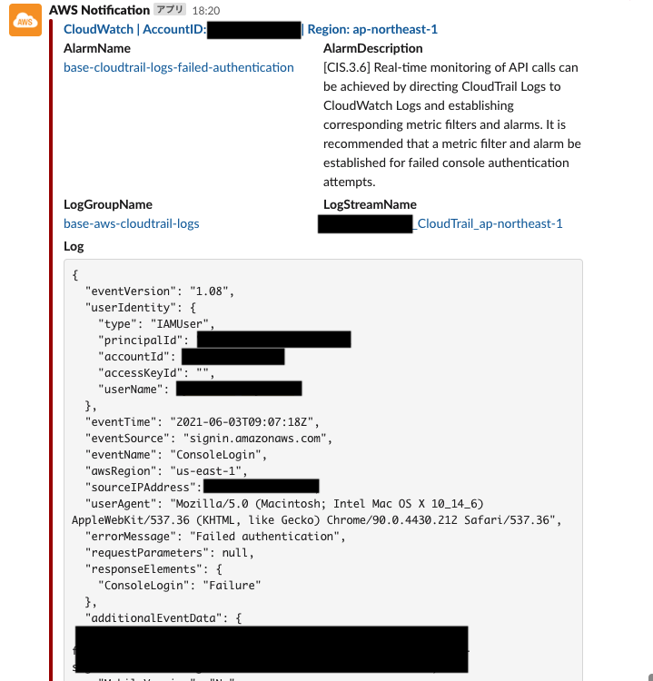

#### Security:Config

AWS Config is a service that allows you to evaluate, audit, and review the configuration of AWS resources. Config continuously monitors and records the configuration of AWS resources and automatically evaluates the recorded configuration against the desired settings. Config allows you to review configuration and association changes between AWS resources, examine detailed resource configuration history, and verify overall compliance with settings specified in company guidelines. This simplifies compliance audits, security analysis, change management, and operational troubleshooting.

After configuring the Slack channel, adding the Slack app, and setting the OAuthToken, Slack notifications will be sent.  
You will be notified with a message similar to the following.

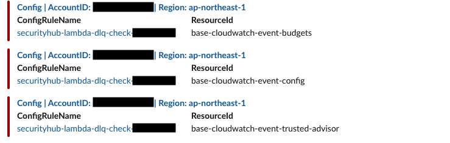

#### Security:Default VPC

Default VPC hardening ensures that the default VPC in each region is secured by removing default rules and applying restrictive configurations. This includes disabling default security group rules and enabling VPC Flow Logs for monitoring.

#### Security:EBS

Manages EBS account-level security defaults including EBS Encryption by Default and public snapshot access blocking. This ensures all new EBS volumes are encrypted and prevents accidental public exposure of snapshots.

#### Security:EC2 Metadata (IMDSv2)

Enforces Instance Metadata Service Version 2 (IMDSv2) at the account level via `aws_ec2_instance_metadata_defaults`. This sets `http_tokens = "required"` so all new EC2 instances default to IMDSv2 without needing per-instance configuration. (Security Hub: EC2.8)

#### Security:ECR

Configures ECR account-level security defaults by setting the basic scan type to `AWS_NATIVE`, which uses AWS's native scanning technology for container image vulnerability scanning.

#### Security:GuardDuty

Amazon GuardDuty is a threat detection service that continuously monitors for malicious or unauthorized activity in order to protect AWS accounts, workloads, and data stored in Amazon S3.

After configuring the Slack channel, adding the Slack app, and setting the OAuthToken, Slack notifications will be sent.  
You will be notified with a message similar to the following.

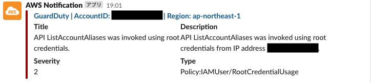

#### Security:Inspector2

Amazon Inspector is an automated vulnerability management service that continually scans AWS workloads for software vulnerabilities and unintended network exposure. Inspector2 supports scanning for EC2 instances, container images in ECR, and Lambda functions.

#### Security:Macie

Amazon Macie is a data security service that uses machine learning and pattern matching to discover and help protect your sensitive data stored in Amazon S3. Macie automatically detects sensitive data such as personally identifiable information (PII) and financial data.

#### Security:Security Hub

The AWS Security Hub provides a comprehensive view of security alerts and security status across all your AWS accounts. A wide range of sophisticated security tools are at your disposal, from firewall and endpoint protection to vulnerability and compliance scanners.

The three security standards provided in the Security Hub are addressed to the best of our ability.

- AWS Foundational Security Best Practices
- CIS AWS Foundations Benchmark
- PCI DSS v3.2.1

The following is the security score when only this Terraform is applied.  
You should be aware that the score will not be accurate until you re-evaluate it after building.

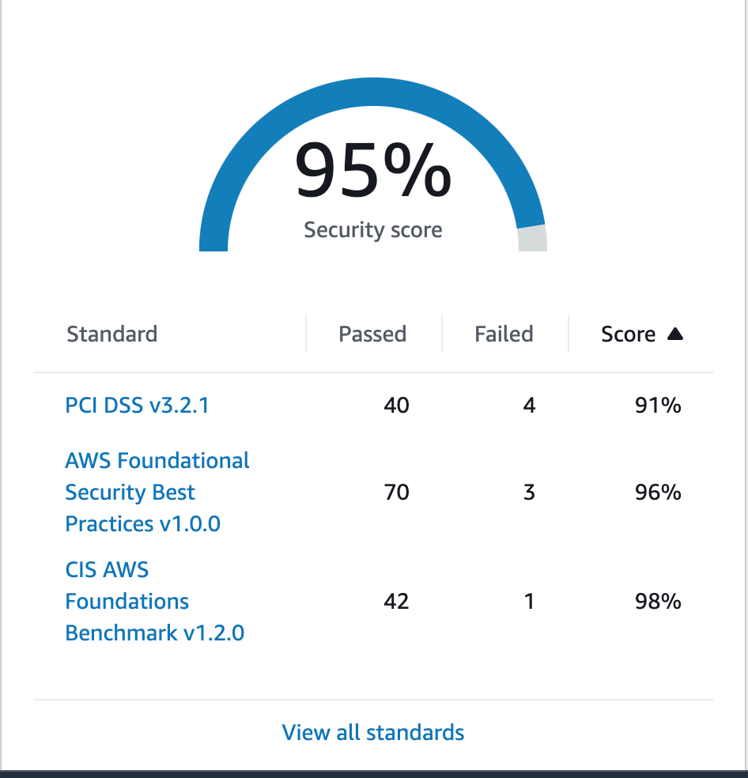

For a detailed mapping of CIS AWS Foundations Benchmark controls to the modules in this repository, see [CIS Benchmark Compliance Matrix](./docs/cis-benchmark.md).

For AWS security service coverage including services not yet implemented and their reasons, see [Security Coverage](./docs/security-coverage.md).

#### Security:SSM Automation

Configures AWS Systems Manager Automation documents for automated remediation of security findings. This enables automatic response to specific security issues detected by Config rules and Security Hub.

### Other

#### Other:AWS Support App

Creates the IAM role and policy required for AWS Support App integration. This role enables AWS Support App to access support cases and provide notifications through Slack.

#### Other:Budgets

AWS Budgets provides the ability to set up custom budgets and be alerted when costs or usage exceed (or are expected to exceed) the budgeted amount or amounts.

After configuring the Slack channel, adding the Slack app, and setting the OAuthToken, you will receive Slack notifications at the specified time (default is 18:00 JST daily). An email will also be sent if the specified cost limit is exceeded.

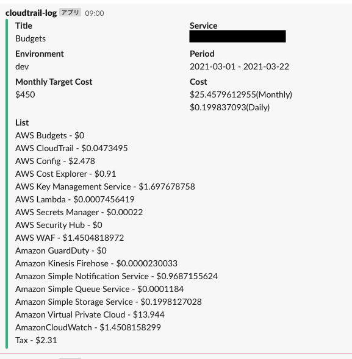  
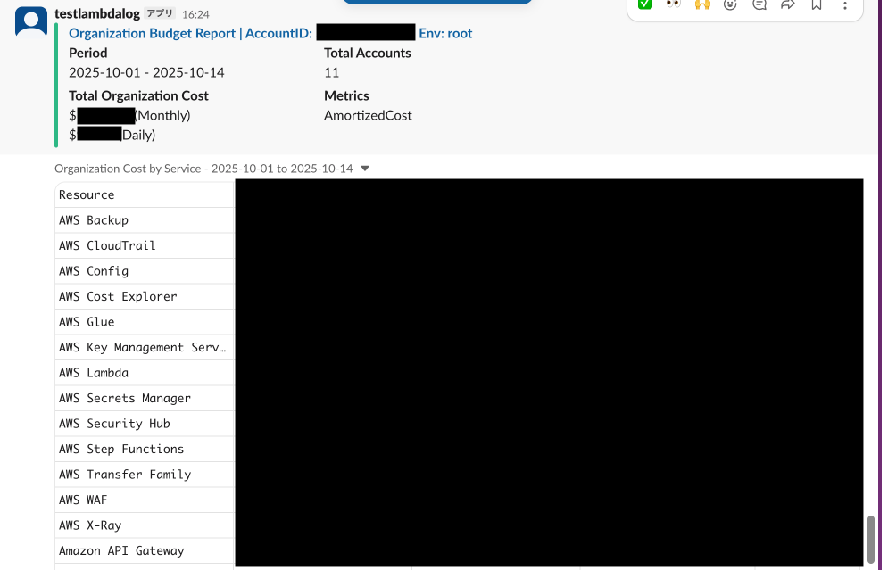

#### Other:Compute Optimizer

AWS Compute Optimizer recommends optimal AWS resources for your workloads to reduce costs and improve performance by using machine learning to analyze historical utilization metrics. Over-provisioning resources can lead to unnecessary infrastructure cost, and under-provisioning resources can lead to poor application performance. Compute Optimizer helps you choose optimal configurations for three types of AWS resources: Amazon EC2 instances, Amazon EBS volumes, and AWS Lambda functions, based on your utilization data.

#### Other:Health Events

Configures EventBridge (CloudWatch Events) to monitor AWS Health events and send notifications to Slack. AWS Health provides alerts about AWS service events that may affect your resources, including scheduled maintenance events, service disruptions, and resource-specific health notifications.

#### Other:IAM group policy

You can set the policy to assign to IAM groups. You can also make the virtual MFA setting mandatory as a base policy.  
You can also configure the IAM Switch Role.

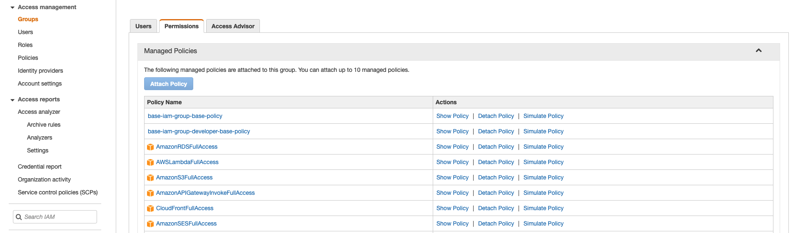

#### Other:IAM Password Expired

Configures EventBridge Scheduler to check for expired or expiring IAM user passwords and send notifications to Slack. This helps maintain security compliance by ensuring users update their passwords regularly.

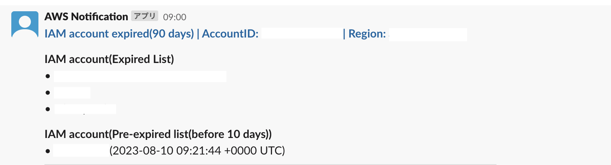

#### Other:IAM User and Group

You can create an IAM User and Group.

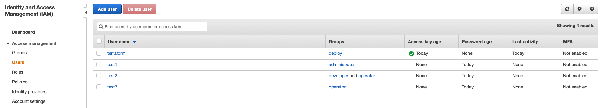
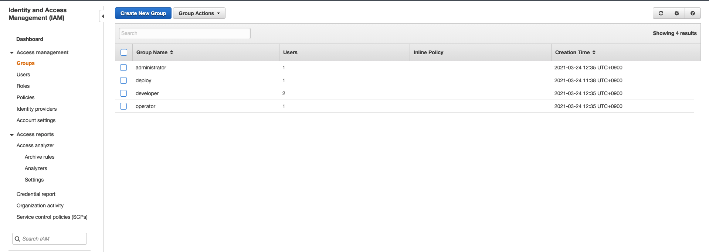

#### Other:OIDC GitHub

Configures GitHub Actions as an IAM OIDC identity provider in AWS. This allows GitHub Actions workflows to authenticate with AWS without storing long-lived credentials, using OpenID Connect federation.

#### Other:Resource Groups

Overall, all resources created in Terraform will have the same TAG, and Resource Groups will be filtered by that TAG.

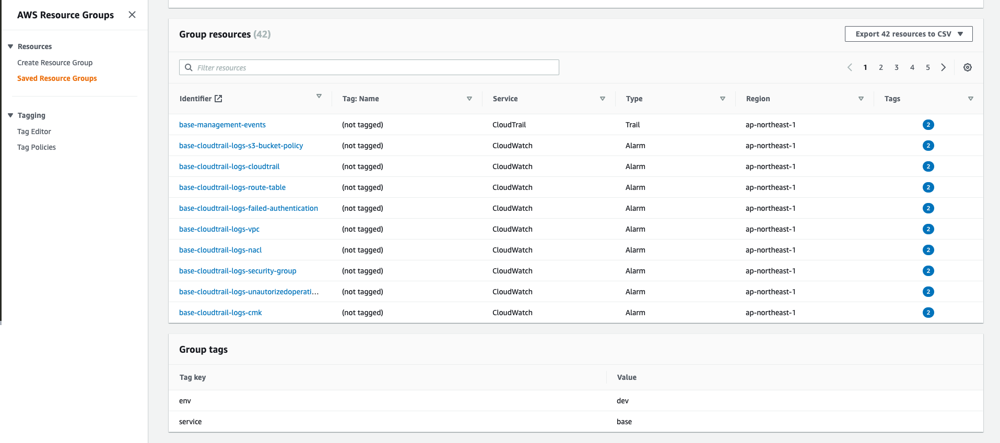

#### Other:Trusted Advisor

AWS Trusted Advisor is a fully managed service that provides guidance on how to follow AWS best practices. Improve security and performance, reduce costs, and monitor service limitations.

After configuring the Slack channel, adding the Slack app, and setting the OAuthToken, you will be able to receive Slack notifications at the specified time (default is 9:00 JST daily).  
However, Trusted Advisor requires the support plan to be signed up for the Business or Enterprise plan. The default setting is false.

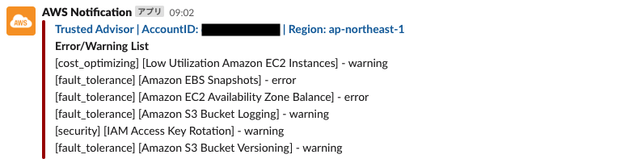

## Monitor

This is a description of [Terraform's Monitor](./terraform/monitor/). The following contents provide an overview of each function.

### Log

You can use Amazon CloudWatch Logs to monitor, store, and access your log files from Amazon Elastic Compute Cloud (Amazon EC2) instances, AWS CloudTrail, Route 53, and other sources.

CloudWatch Logs enables you to centralize the logs from all of your systems, applications, and AWS services that you use, in a single, highly scalable service. You can then easily view them, search them for specific error codes or patterns, filter them based on specific fields, or archive them securely for future analysis. CloudWatch Logs enables you to see all of your logs, regardless of their source, as a single and consistent flow of events ordered by time, and you can query them and sort them based on other dimensions, group them by specific fields, create custom computations with a powerful query language, and visualize log data in dashboards.

Reference: [What is Amazon CloudWatch Logs?](https://docs.aws.amazon.com/AmazonCloudWatch/latest/logs/WhatIsCloudWatchLogs.html)

#### Log:Application

The filter function of CloudWatchLogs can be used to check specified logs with specified filter patterns. Those that hit the filter pattern will be notified by Slack via Lambda.

In addition, a daily report function is available that aggregates application error logs and sends a summary to Slack via EventBridge Scheduler.

#### Log:MySQL

The filter function of CloudWatchLogs can be used to check MySQL slow query logs with specified filter patterns. Those that hit the filter pattern will be notified by Slack via Lambda.

#### Log:PostgreSQL

The filter function of CloudWatchLogs can be used to check specified logs with specified filter patterns. Those that hit the filter pattern will be notified by Slack via Lambda.

In addition, a daily report function is available that aggregates PostgreSQL slow query logs and sends a summary to Slack via EventBridge Scheduler.

#### Log:Step Functions

The filter function of CloudWatchLogs can be used to check Step Functions execution logs with specified filter patterns. Those that hit the filter pattern will be notified by Slack via Lambda.

#### Log:WAF

The filter function of CloudWatchLogs can be used to check AWS WAF logs with specified filter patterns. Those that hit the filter pattern will be notified by Slack via Lambda.

### Metrics

Metrics are data about the performance of your systems. By default, many services provide free metrics for resources (such as Amazon EC2 instances, Amazon EBS volumes, and Amazon RDS DB instances). You can also enable detailed monitoring for some resources, such as your Amazon EC2 instances, or publish your own application metrics. Amazon CloudWatch can load all the metrics in your account (both AWS resource metrics and application metrics that you provide) for search, graphing, and alarms.

Reference: [Using Amazon CloudWatch metrics](https://docs.aws.amazon.com/AmazonCloudWatch/latest/monitoring/working_with_metrics.html)

#### Metrics:API Gateway

Metrics about API Gateway will be checked and you will be notified via Slack if the specified threshold is exceeded.

Reference: [Amazon API Gateway dimensions and metrics](https://docs.aws.amazon.com/apigateway/latest/developerguide/api-gateway-metrics-and-dimensions.html)

#### Metrics:CloudFront

Metrics about CloudFront will be checked and you will be notified via Slack if the specified threshold is exceeded.

Reference: [Monitoring CloudFront metrics with Amazon CloudWatch](https://docs.aws.amazon.com/AmazonCloudFront/latest/DeveloperGuide/monitoring-using-cloudwatch.html)

#### Metrics:EC2

Metrics about EC2 will be checked and you will be notified via Slack if the specified threshold is exceeded.  
  
Reference: [Monitoring use with CloudWatch Metrics](https://docs.aws.amazon.com/AWSEC2/latest/UserGuide/viewing_metrics_with_cloudwatch.html)

#### Metrics:ECS Container Insights

Metrics about ECS using Container Insights will be checked and you will be notified via Slack if the specified threshold is exceeded. Monitors CPU utilization, memory utilization, and running task count for ECS services.

Reference: [Using Container Insights](https://docs.aws.amazon.com/AmazonCloudWatch/latest/monitoring/ContainerInsights.html)

#### Metrics:ElastiCache

Metrics about ElastiCache will be checked and you will be notified via Slack if the specified threshold is exceeded.  
  
Reference: [Monitoring use with CloudWatch Metrics](https://docs.aws.amazon.com/AmazonElastiCache/latest/red-ug/CacheMetrics.html)

#### Metrics:ELB (ALB/NLB)

Metrics about ELB (both ALB and NLB) will be checked and you will be notified via Slack if the specified threshold is exceeded.

Reference: [CloudWatch metrics for your Application Load Balancer](https://docs.aws.amazon.com/elasticloadbalancing/latest/application/load-balancer-cloudwatch-metrics.html)

#### Metrics:EventBridge Scheduler

Metrics about EventBridge Scheduler will be checked and you will be notified via Slack if the specified threshold is exceeded. Monitors invocation counts, failures, and throttles.

Reference: [Monitoring Amazon EventBridge Scheduler](https://docs.aws.amazon.com/scheduler/latest/UserGuide/monitoring-overview.html)

#### Metrics:Lambda

Metrics about Lambda will be checked and you will be notified via Slack if the specified threshold is exceeded.  
  
Reference: [Working with Lambda function metrics](https://docs.aws.amazon.com/lambda/latest/dg/monitoring-metrics.html)

#### Metrics:NAT Gateway

Metrics about NAT Gateway will be checked and you will be notified via Slack if the specified threshold is exceeded.

Reference: [NAT gateway metrics and dimensions](https://docs.aws.amazon.com/vpc/latest/userguide/metrics-dimensions-nat-gateway.html)

#### Metrics:RDS

Metrics about RDS will be checked and you will be notified via Slack if the specified threshold is exceeded.  
  
Reference: [Monitoring Amazon RDS metrics with Amazon CloudWatch](https://docs.aws.amazon.com/AmazonRDS/latest/UserGuide/monitoring-cloudwatch.html)

#### Metrics:Redshift

Metrics about Redshift will be checked and you will be notified via Slack if the specified threshold is exceeded. Monitors CPU utilization, disk space, and connection counts.

Reference: [Monitoring Amazon Redshift using CloudWatch metrics](https://docs.aws.amazon.com/redshift/latest/mgmt/metrics-listing.html)

#### Metrics:SES

Metrics about SES will be checked and you will be notified via Slack if the specified threshold is exceeded.  
  
Reference: [Retrieving Amazon SES event data from CloudWatch](https://docs.aws.amazon.com/ses/latest/dg/event-publishing-retrieving-cloudwatch.html)

#### Metrics:SNS

Metrics about SNS will be checked and you will be notified via Slack if the specified threshold is exceeded. Monitors delivery failures and message counts.

Reference: [Monitoring Amazon SNS topics using CloudWatch](https://docs.aws.amazon.com/sns/latest/dg/sns-monitoring-using-cloudwatch.html)

#### Metrics:SQS

Metrics about SQS will be checked and you will be notified via Slack if the specified threshold is exceeded. Monitors queue depth, age of oldest message, and dead-letter queue metrics.

Reference: [Available CloudWatch metrics for Amazon SQS](https://docs.aws.amazon.com/AWSSimpleQueueService/latest/SQSDeveloperGuide/sqs-available-cloudwatch-metrics.html)

#### Metrics:Synthetics Canary

You can use Amazon CloudWatch Synthetics to create canaries, configurable scripts that run on a schedule, to monitor your endpoints and APIs. Canaries follow the same routes and perform the same actions as a customer, which makes it possible for you to continually verify your customer experience even when you don't have any customer traffic on your applications. By using canaries, you can discover issues before your customers do.

Using Synthetics Canary, the status code is checked against the specified URL,
and if an unexpected status code is returned, the user is notified via Slack.  
  
Reference: [Using synthetic monitoring](https://docs.aws.amazon.com/AmazonCloudWatch/latest/monitoring/CloudWatch_Synthetics_Canaries.html)

### CloudWatch Events(EventBridge)

Amazon EventBridge is a serverless event bus service that you can use to connect your applications with data from a variety of sources. EventBridge delivers a stream of real-time data from your applications, software as a service (SaaS) applications, and AWS services to targets such as AWS Lambda functions, HTTP invocation endpoints using API destinations, or event buses in other AWS accounts.

Reference: [What Is Amazon EventBridge?](https://docs.aws.amazon.com/eventbridge/latest/userguide/eb-what-is.html)

#### CloudWatch Events:Batch

AWS Batch job events are monitored via EventBridge Scheduler. This includes job state changes (SUBMITTED, PENDING, RUNNABLE, STARTING, RUNNING, SUCCEEDED, FAILED).

#### CloudWatch Events:EC2

The following events are monitored.

- EC2 Instance Rebalance Recommendation  
  https://docs.aws.amazon.com/AWSEC2/latest/UserGuide/rebalance-recommendations.html
- EC2 Spot Instance Interruption Warning  
  https://docs.aws.amazon.com/AWSEC2/latest/UserGuide/spot-instance-termination-notices.html

#### CloudWatch Events:ECS Scheduled Task

ECS scheduled task events are monitored via EventBridge Scheduler. This tracks scheduled task execution status and failures.

#### CloudWatch Events:ECS Service

ECS service events are monitored via EventBridge Scheduler. This includes service deployment state changes, task placement failures, and service steady state notifications.

#### CloudWatch Events:RDS Cluster

RDS Aurora cluster events are monitored via EventBridge Scheduler. This includes failover events, maintenance notifications, and configuration changes.

#### CloudWatch Events:Redshift

Redshift cluster events are monitored via EventBridge Scheduler. This includes cluster maintenance events, snapshot events, and configuration changes.

### Athena

Amazon Athena is an interactive query service that makes it easy to analyze data directly in Amazon Simple Storage Service (Amazon S3) using standard SQL. With a few actions in the AWS Management Console, you can point Athena at your data stored in Amazon S3 and begin using standard SQL to run ad-hoc queries and get results in seconds.  
Reference: [What is Amazon Athena?](https://docs.aws.amazon.com/athena/latest/ug/what-is.html)  

#### Athena: Named Query
Named Query (Named Query, Saved Query) is an Amazon Athena feature that allows you to name and save SQL queries and call them from the console.

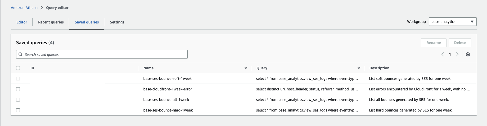
#### Athena: CloudFront
If you are using CloudFront to store your standard logs in S3, you can retrieve the logs from Athena using SQL.  
When the Athena function is enabled, a table is created for CloudFront and a named query is created for easy searching.  

Reference: [Configuring and using standard logs (access logs)](https://docs.aws.amazon.com/AmazonCloudFront/latest/DeveloperGuide/AccessLogs.html)

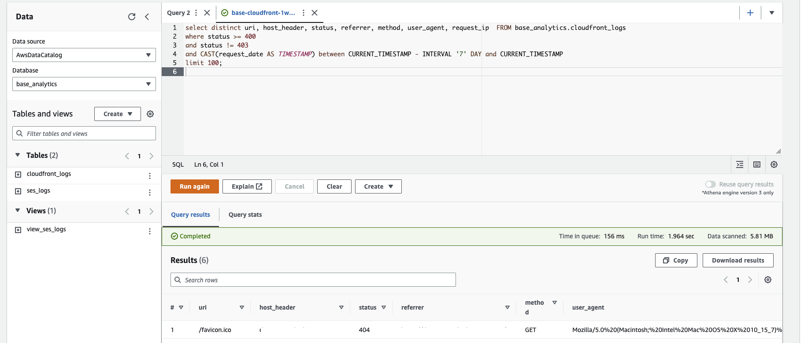

#### Athena: SES
If you are using SES to store your standard logs in S3, you can retrieve the logs from Athena using SQL.  
When the Athena function is enabled, a table is created for SES and a named query is created for easy searching.  

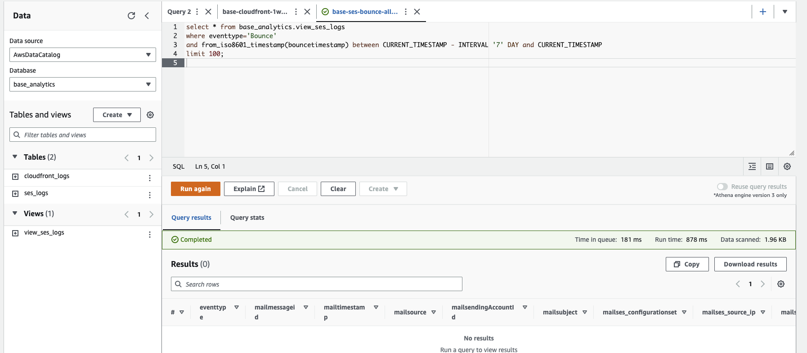

### Author Information

Author: Yoshiaki Miyazaki  
Contact: https://github.com/y-miyazaki
