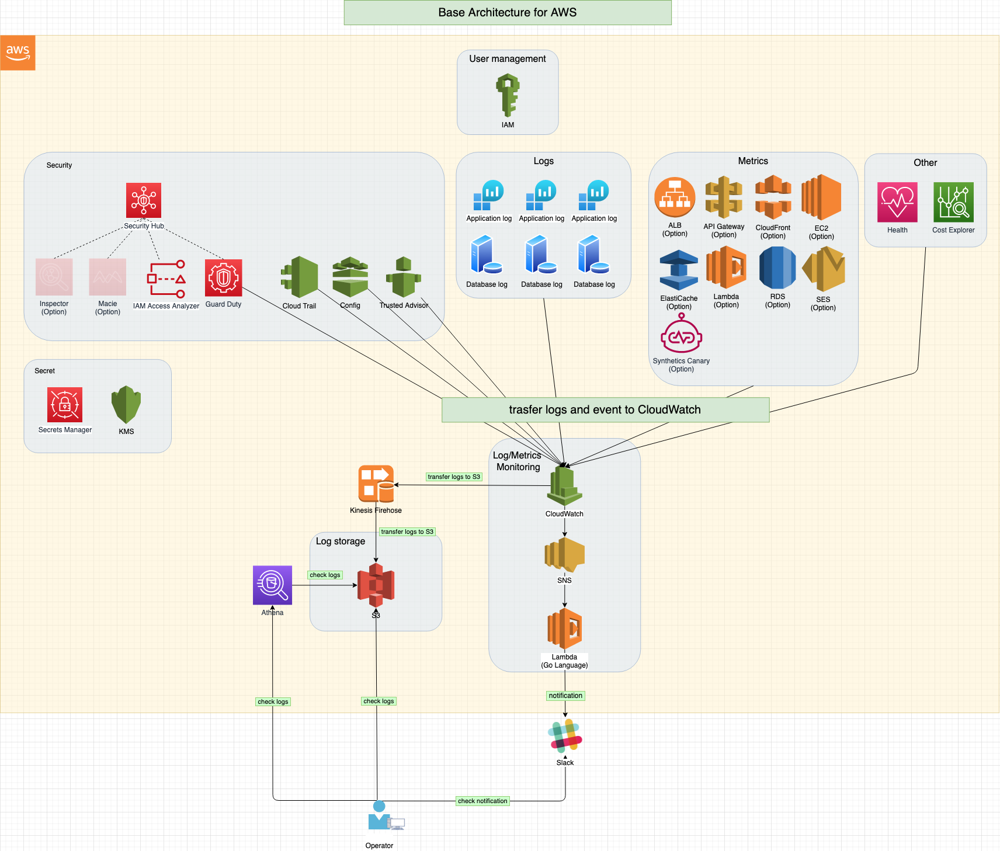

<!-- omit in toc -->
# AWS Base Terraform Infrastructure


Terraform baseline configuration for AWS accounts — security, IAM, cost management, logging, and monitoring.

Each feature is toggled on/off via `terraform.example.tfvars`. The directory is divided into three stacks:

| Stack | Purpose | Configuration |
|-------|---------|---------------|
| [base](./terraform/base) | Core security, IAM, cost controls | [tfvars guide](./docs/how-to/configure-base-tfvars.md) |
| [management/audit](./terraform/management/audit) | Organization-level security monitoring | [tfvars guide](./docs/how-to/configure-management-audit-tfvars.md) |
| [management/root](./terraform/management/root) | Root account governance and policies | [tfvars guide](./docs/how-to/configure-management-root-tfvars.md) |
| [monitor](./terraform/monitor) | CloudWatch metrics, logs, events | [tfvars guide](./docs/how-to/configure-monitor-tfvars.md) |

<!-- omit in toc -->
## Table of Contents

- [Quick Start](#quick-start)
- [Requirements](#requirements)
- [Architecture](#architecture)
- [Features](#features)
  - [Security](#security)
  - [Management](#management)
  - [Other](#other)
  - [Monitoring: Metrics](#monitoring-metrics)
  - [Monitoring: Logs](#monitoring-logs)
  - [Monitoring: Events](#monitoring-events)
  - [Monitoring: Athena](#monitoring-athena)
- [Directory Structure](#directory-structure)
- [Documentation](#documentation)
- [Author Information](#author-information)

## Quick Start

1. Clone the repository:

   ```bash
   git clone https://github.com/y-miyazaki/terraform-aws-base.git
   cd terraform-aws-base
   ```

2. Copy and edit tfvars:

   ```bash
   cp terraform/base/terraform.example.tfvars terraform/base/terraform.tfvars
   ```

3. Configure features — see [Configuration Guide](./docs/how-to/configure-base-tfvars.md)

4. Apply:

   ```bash
   terraform -chdir=terraform/base init
   terraform -chdir=terraform/base plan
   terraform -chdir=terraform/base apply
   ```

## Requirements

- [Terraform](https://www.terraform.io/)
- [AWS CLI](https://docs.aws.amazon.com/cli/latest/userguide/getting-started-install.html) — configured with credentials (`aws configure` or environment variables)
- [Slack](https://slack.com/) — OAuthToken and ChannelID for notifications ([Creating a Slack App](https://api.slack.com/start/quickstart))

## Architecture

The architecture when all elements are enabled is shown below. Each resource can be included or removed depending on the infrastructure configuration.



## Features

### Security

For detailed descriptions and Slack notification examples, see [Features: Base](./docs/reference/features-base.md#security).

| Feature | Description | Reference |
|---------|-------------|-----------|
| Access Analyzer | Detects unintended external access to resources | [Docs](https://docs.aws.amazon.com/IAM/latest/UserGuide/what-is-access-analyzer.html) |
| Athena (Security) | Athena workgroup for security log queries | — |
| CloudTrail | API activity logging and governance auditing | [Docs](https://docs.aws.amazon.com/awscloudtrail/latest/userguide/) |
| Config | Configuration compliance monitoring and recording | [Docs](https://docs.aws.amazon.com/config/latest/developerguide/) |
| Default VPC | Hardens default VPC by removing default rules | [Docs](https://docs.aws.amazon.com/vpc/latest/userguide/default-vpc.html) |
| EBS | Encryption by default and public snapshot blocking | [Docs](https://docs.aws.amazon.com/ebs/latest/userguide/ebs-encryption.html) |
| EC2 Metadata (IMDSv2) | Enforces IMDSv2 at account level | [Docs](https://docs.aws.amazon.com/AWSEC2/latest/UserGuide/configuring-instance-metadata-service.html) |
| ECR | Sets native scanning for container images | [Docs](https://docs.aws.amazon.com/AmazonECR/latest/userguide/image-scanning.html) |
| GuardDuty | Continuous threat detection | [Docs](https://docs.aws.amazon.com/guardduty/latest/ug/) |
| Inspector2 | Automated vulnerability scanning (EC2, ECR, Lambda) | [Docs](https://docs.aws.amazon.com/inspector/latest/user/) |
| Macie | Sensitive data discovery in S3 | [Docs](https://docs.aws.amazon.com/macie/latest/user/) |
| Security Hub | Centralized security posture and compliance | [Docs](https://docs.aws.amazon.com/securityhub/latest/userguide/) |
| SSM Automation | Automated remediation of security findings | [Docs](https://docs.aws.amazon.com/systems-manager/latest/userguide/systems-manager-automation.html) |

Related: [CIS Benchmark Compliance Matrix](./docs/reference/cis-benchmark.md) · [Security Coverage](./docs/reference/security-coverage.md)

### Management

| Feature | Stack | Description |
|---------|-------|-------------|
| Chatbot (Slack) | audit | Slack notifications for security findings |
| GuardDuty Organization | audit | Centralized threat detection across accounts |
| Security Hub Organization | audit | Centralized compliance monitoring |
| Access Analyzer Organization | audit | Cross-account external access detection |
| Inspector2 Organization | audit | Organization-wide vulnerability scanning |
| Macie Organization | audit | Organization-wide sensitive data discovery |
| Budgets | root | Cost monitoring and alerting |
| CloudTrail (Organization) | root | Organization-level API audit trail |
| Organizational Policies | root | SCPs and governance policies |
| OIDC GitHub | root | CI/CD authentication via OIDC federation |
| JIT Access | root | Temporary privileged access via Slack approval |

For JIT Access details, see [JIT Access Specification](./docs/reference/jit-access-specification.md).

### Other

For detailed descriptions, see [Features: Base](./docs/reference/features-base.md#other).

| Feature | Description |
|---------|-------------|
| AWS Support App | IAM role for Support App Slack integration |
| Budgets | Cost alerts via Slack (daily) and email (threshold exceeded) |
| Compute Optimizer | Resource optimization recommendations |
| Health Events | AWS Health event notifications to Slack |
| IAM Group Policy | Group policy assignment with MFA enforcement |
| IAM Password Expired | Password expiry notifications to Slack |
| IAM User and Group | IAM user and group creation |
| OIDC GitHub | GitHub Actions OIDC provider for credential-free CI/CD |
| Resource Groups | TAG-based resource grouping |
| Trusted Advisor | Best practice notifications (requires Business/Enterprise plan) |

### Monitoring: Metrics

For detailed descriptions, see [Features: Monitor](./docs/reference/features-monitor.md). Alarms notify via SNS → Lambda → Slack when thresholds are exceeded.

| Service | Metrics Monitored | Reference |
|---------|-------------------|-----------|
| API Gateway | 4xx/5xx errors, latency | [Docs](https://docs.aws.amazon.com/apigateway/latest/developerguide/api-gateway-metrics-and-dimensions.html) |
| CloudFront | Error rate, requests | [Docs](https://docs.aws.amazon.com/AmazonCloudFront/latest/DeveloperGuide/monitoring-using-cloudwatch.html) |
| EC2 | CPU, status checks, disk | [Docs](https://docs.aws.amazon.com/AWSEC2/latest/UserGuide/viewing_metrics_with_cloudwatch.html) |
| ECS Container Insights | CPU, memory, running tasks | [Docs](https://docs.aws.amazon.com/AmazonCloudWatch/latest/monitoring/ContainerInsights.html) |
| ElastiCache | CPU, memory, connections | [Docs](https://docs.aws.amazon.com/AmazonElastiCache/latest/red-ug/CacheMetrics.html) |
| ELB (ALB/NLB) | 5xx errors, latency, unhealthy targets | [Docs](https://docs.aws.amazon.com/elasticloadbalancing/latest/application/load-balancer-cloudwatch-metrics.html) |
| EventBridge Scheduler | Invocations, failures, throttles | [Docs](https://docs.aws.amazon.com/scheduler/latest/UserGuide/monitoring-overview.html) |
| Lambda | Errors, duration, throttles | [Docs](https://docs.aws.amazon.com/lambda/latest/dg/monitoring-metrics.html) |
| NAT Gateway | Bandwidth, packets, errors | [Docs](https://docs.aws.amazon.com/vpc/latest/userguide/metrics-dimensions-nat-gateway.html) |
| RDS | CPU, connections, free storage | [Docs](https://docs.aws.amazon.com/AmazonRDS/latest/UserGuide/monitoring-cloudwatch.html) |
| Redshift | CPU, disk, connections | [Docs](https://docs.aws.amazon.com/redshift/latest/mgmt/metrics-listing.html) |
| SES | Bounce rate, complaint rate | [Docs](https://docs.aws.amazon.com/ses/latest/dg/event-publishing-retrieving-cloudwatch.html) |
| SNS | Delivery failures, message counts | [Docs](https://docs.aws.amazon.com/sns/latest/dg/sns-monitoring-using-cloudwatch.html) |
| SQS | Queue depth, oldest message age, DLQ metrics | [Docs](https://docs.aws.amazon.com/AWSSimpleQueueService/latest/SQSDeveloperGuide/sqs-available-cloudwatch-metrics.html) |
| Synthetics Canary | Success rate, status codes | [Docs](https://docs.aws.amazon.com/AmazonCloudWatch/latest/monitoring/CloudWatch_Synthetics_Canaries.html) |

### Monitoring: Logs

CloudWatch Logs metric filters detect patterns and notify via Lambda → Slack.

| Log Source | Filter Target | Daily Report |
|------------|---------------|--------------|
| Application | Custom filter patterns | ✅ Error summary |
| MySQL | Slow query patterns | — |
| PostgreSQL | Error and slow query patterns | ✅ Slow query summary |
| Step Functions | Execution failure patterns | — |
| WAF | Blocked request patterns | — |

### Monitoring: Events

EventBridge rules monitor service state changes and notify via Lambda → Slack.

| Event Source | Events Monitored |
|--------------|-----------------|
| Batch | Job state changes (FAILED, SUCCEEDED, etc.) |
| EC2 | Spot interruption, rebalance recommendation |
| ECS Scheduled Task | Scheduled task execution status |
| ECS Service | Deployment state, task placement failures |
| RDS Cluster | Failover, maintenance, configuration changes |
| Redshift | Maintenance, snapshot, configuration changes |

### Monitoring: Athena

Named queries for ad-hoc log analysis in S3.

| Data Source | Description |
|-------------|-------------|
| CloudFront | Standard access log analysis via SQL |
| SES | Event log analysis via SQL |

## Directory Structure

| Directory/File | Description |
|----------------|-------------|
| .github/ | GitHub Actions workflows and related configurations |
| docs/ | Architecture, design decisions, and module catalog documentation |
| env/ | Environment-specific configurations and devcontainer settings |
| lambda/ | Lambda function outputs and related files |
| modules/ | Reusable Terraform modules for AWS services |
| nodejs/ | Node.js function outputs and related files |
| scripts/ | Automation scripts for validation, deployment, and resource management |
| terraform/ | Environment-specific Terraform configurations |
| terraform/base/ | Base infrastructure configurations for core AWS resources |
| terraform/management/ | Management-level configurations (audit and root) |
| terraform/monitor/ | Monitoring and metrics configurations |
| test/ | Test configurations and resources |

## Documentation

Full documentation follows the [Diataxis](https://diataxis.fr/) framework:

| Category | Contents |
|----------|----------|
| [Tutorials](./docs/tutorials/) | Learning-oriented walkthroughs (e.g., [Quickstart](./docs/tutorials/baseline-quickstart.md)) |
| [How-To](./docs/how-to/) | Task-oriented guides (e.g., [Troubleshooting](./docs/how-to/troubleshooting.md)) |
| [Reference](./docs/reference/) | Technical descriptions (e.g., [Module Catalog](./docs/reference/module-catalog.md), [Monitoring](./docs/reference/monitoring.md)) |
| [Explanation](./docs/explanation/) | Design decisions and architecture (e.g., [Architecture](./docs/explanation/architecture.md)) |

See [docs/index.md](./docs/index.md) for the complete index.

## Author Information

Author: Yoshiaki Miyazaki
Contact: https://github.com/y-miyazaki
