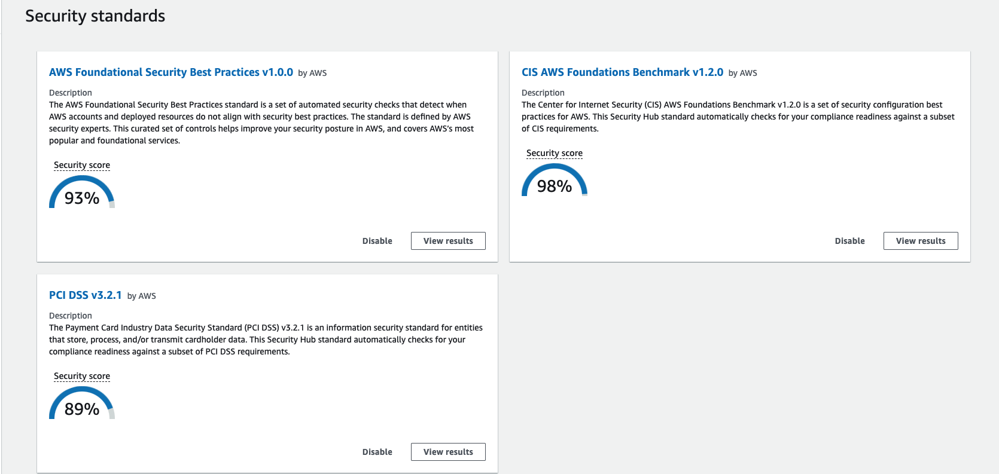

# AWS Base Terraform

## OverView

When building an infrastructure on AWS, there are always things to consider in any project.
For example, security, IAM, cost, log storage / notification related, etc ...
Building a Terraform separately for each project, which must be considered, can be a daunting task.
In this repository, it corresponds to the items that should be set basically.

## INDEX

- Functions
  - [Security Hub](#security-hub)
  - [Resource Groups](#resource-groups)
  - [IAM User and Group](#iam-user-and-group)
  - [IAM group policy](#iam-group-policy)
  - [CloudTrail](#cloudTrail)
  - [GuardDuty](#guardduty)
  - [Cost Management](#cost-management)
  - [Trusted Advisor](#trusted-advisor)
  - [CloudWatch](#cloudWatch)
- Settings
  - [Initial setting](#initial-setting)
- Logs
  - [S3 bucket list](#s3-bucket-list)

## Required

- Terraform
  Requires the Terraform command.  
  https://www.terraform.io/
- Slack
  You'll need Slack, OAuthToken, and ChannelID for notifications.  
  https://slack.com/  
  https://slack.dev/node-slack-sdk/getting-started

## Security Hub

It is as close as possible to the three security standards provided by the Security Hub.

- AWS Foundational Security Best Practices
- CIS AWS Foundations Benchmark
- PCI DSS v3.2.1

The following content is the Security score when only this Terraform is applied.  
`After building, you need to be aware that you will not get an accurate score unless you re-evaluate.`



By setting the Slack channel, adding the Slack app, and setting the OAuthToken, Slack notifications will be sent.  
You will be notified with a message similar to the following:


## Resource Groups

Overall, all resources created by Terraform are the same TAG, and Resource Groups filtered by that TAG are created.


## IAM User and Group

You can create IAM Users and Groups.


## IAM group policy

You can set policies to allocate to IAM groups. You can also require virtual MFA configuration as a base policy.


## CloudTrail

By setting the Slack channel, adding the Slack app, and setting the OAuthToken, Slack notifications will be sent.  
You will be notified with a message similar to the following:


## GuardDuty

By setting the Slack channel, adding the Slack app, and setting the OAuthToken, Slack notifications will be sent.  
You will be notified with a message similar to the following:


## Cost Management

By setting the Slack channel, adding the Slack app, and setting the OAuthToken, you will receive Slack notifications at the specified time (default is 9:00 JST every day). Also, if the specified cost limit is exceeded, an email will be sent.


## Trusted Advisor

By setting the Slack channel, adding the Slack app, and setting the OAuthToken, you will receive Slack notifications at the specified time (default is 9:00 JST every day).  
However, Trusted Advisor requires a contract for a business plan or an enterprise plan as a support plan. The default is false.

## CloudWatch

By setting the Slack channel, adding the Slack app, and setting the OAuthToken, you will receive Slack notifications that match the filter conditions of the specified log group.

## Initial setting

- Remove access key from root account
  Due to security issues, remove the root account access key from the management console.

- Manual creation of IAM users and IAM groups to run Terraform
  Create an IAM user and IAM group from the management console to run Terraform.
  Create an IAM group (pseudonym: deploy). The policy attaches AdministratorAccess.
  Create an IAM user (pseudonym: terraform). Access Type gives only Programmatic access. Add to the IAM group (pseudonym: deploy).

- Create S3 to save Terraform State
  Create S3 from the management console to manage Terraform State.
  However, if you have an environment in which the aws command and profile have been set and can be executed, executing the following command will create S3.
  https://github.com/y-miyazaki/cloud-commands/blob/master/cmd/awstfinitstate

```sh
# awstfinitstate -h

This command creates a S3 Bucket for Terraform State.
You can also add random hash to bucket name suffix.

Usage:
    awstfinitstate -r {region} -b {bucket name} -p {profile}[<options>]
    awstfinitstate -r ap-northeast-1 -b terraform-state
    awstfinitstate -r ap-northeast-1 -b terraform-state -p default -s

Options:
    -b {bucket name}          S3 bucket name
    -p {aws profile name}     Name of AWS profile
    -r {region}               S3 region
    -s                        If set, a random hash will suffix bucket name.
    -h                        Usage awstfinitstate

# awstfinitstate -r ap-northeast-1 -b terraform-state -p default -s
~
~
~
~
~
~
~
~
~
~
~
~
~
--------------------------------------------------------------
bucket_name: terraform-state-xxxxxxxxxx
region: ap-northeast-1
--------------------------------------------------------------
```

- terraform.{environment}.tfvars file to set for each environment  
  You need to rename the linked [terraform.example.tfvars](terraform/terraform.example.tfvars) and change each variable for your environment. The variable to be changed contains a TODO comment. Search by TODO.

- main_provider.tf file to be set for each environment  
  Rename the linked [main_provider.tf.example](terraform/main_provider.tf.example) to main_provider.tf. Then you need to change each parameter. The variable to be changed contains a TODO comment. Search by TODO.

```terraform
#--------------------------------------------------------------
# Terraform Provider
#--------------------------------------------------------------
terraform {
  required_version = ">=0.13"
  required_providers {
    aws = {
      source  = "hashicorp/aws"
      version = ">=3.29.1"
    }
  }
  backend "s3" {
    # TODO: need to change bucket for terraform state.
    bucket = "xxxxxxxxxxxxxxxx"
    # TODO: need to change bucket key for terraform state.
    key = "xxxxxxxxxx"
    # TODO: need to change profile for terraform state.
    profile = "default"
    # TODO: need to change region for terraform state.
    region = "ap-northeast-1"
  }
}

#--------------------------------------------------------------
# AWS Provider
# access key and secret key should not use.
#--------------------------------------------------------------
provider "aws" {
  # TODO: need to change profile.
  profile = "default"
  # TODO: need to change region.
  region = "ap-northeast-1"
}
```

- Run Terraform
  Execute with the terraform command. Do terraform apply after terraform init.
  Perhaps terraform apply will fail, but it may fail due to issues such as conflict, so try again and it will succeed.

```sh
bash-5.1# terraform init
There are some problems with the CLI configuration:

Error: The specified plugin cache dir /root/.terraform.d/plugin-cache cannot be opened: stat /root/.terraform.d/plugin-cache: no such file or directory


As a result of the above problems, Terraform may not behave as intended.


Initializing modules...

Initializing the backend...

Initializing provider plugins...
- Reusing previous version of hashicorp/aws from the dependency lock file
- Reusing previous version of hashicorp/random from the dependency lock file
- Reusing previous version of hashicorp/template from the dependency lock file
- Installing hashicorp/aws v3.29.1...
- Installed hashicorp/aws v3.29.1 (signed by HashiCorp)
- Installing hashicorp/random v3.1.0...
- Installed hashicorp/random v3.1.0 (signed by HashiCorp)
- Installing hashicorp/template v2.2.0...
- Installed hashicorp/template v2.2.0 (signed by HashiCorp)

Terraform has been successfully initialized!

You may now begin working with Terraform. Try running "terraform plan" to see
any changes that are required for your infrastructure. All Terraform commands
should now work.

If you ever set or change modules or backend configuration for Terraform,
rerun this command to reinitialize your working directory. If you forget, other
commands will detect it and remind you to do so if necessary.
```

```sh
bash-5.1# terraform apply --auto-approve -var-file=terraform.example.tfvars
module.aws_recipes_s3_bucket_log_logging.random_id.this: Creating...
random_id.this: Creating...
module.aws_recipes_s3_bucket_log_logging.random_id.this: Creation complete after 0s [id=wiatHg]
random_id.this: Creation complete after 0s [id=uqe0bU7J]
module.aws_recipes_security_default_vpc.aws_default_subnet.this[1]: Creating...

...
...
...

Apply complete! Resources: x added, x changed, 0 destroyed.
```

## S3 bucket list

| Category       | bucket         | Directory                                                       | Description                                                                                                                                                                                                                                                                                                                                                                                                                                           | Note                                                                                                                 |
| :------------- | :------------- | :-------------------------------------------------------------- | :---------------------------------------------------------------------------------------------------------------------------------------------------------------------------------------------------------------------------------------------------------------------------------------------------------------------------------------------------------------------------------------------------------------------------------------------------- | :------------------------------------------------------------------------------------------------------------------- |
| AWS Config     | aws-config     | /AWSLogs/{accountID}/Config/{region}/yyyy/m/d/ConfigHistory/    | AWS Config Compliance History Timeline for Resources.                                                                                                                                                                                                                                                                                                                                                                                                 | https://docs.aws.amazon.com/config/latest/developerguide/view-compliance-history.html                                |
| AWS Config     | aws-config     | /AWSLogs/{accountID}/Config/{region}/yyyy/m/d/ConfigSnapshot/   | AWS Config snapshot.                                                                                                                                                                                                                                                                                                                                                                                                                                  | https://docs.aws.amazon.com/config/latest/developerguide/deliver-snapshot-cli.html                                   |
| AWS Config     | aws-config     | /AWSLogs/{accountID}/Config/ConfigWritabilityCheckFile/yyyy/m/d | This is a test file to confirm that Config can be written to the S3 bucket normally.                                                                                                                                                                                                                                                                                                                                                                  |                                                                                                                      |
| AWS CloudTrail | aws-cloudtrail | /AWSLogs/{accountID}/CloudTrail-Digest/{region}/yyyy/mm/dd      | Each digest file contains the names of the log files that were delivered to your Amazon S3 bucket during the last hour, the hash values for those log files, and the digital signature of the previous digest file. The signature for the current digest file is stored in the metadata properties of the digest file object. The digital signatures and hashes are used for validating the integrity of the log files and of the digest file itself. | https://docs.aws.amazon.com/awscloudtrail/latest/userguide/cloudtrail-log-file-validation-digest-file-structure.html |
| AWS CloudTrail | aws-cloudtrail | /AWSLogs/{accountID}/CloudTrail-Insight/{region}/yyyy/mm/dd     | CloudTrail Insights can help you detect unusual API activity in your AWS account by raising Insights events. CloudTrail Insights measures your normal patterns of API call volume, also called the baseline, and generates Insights events when the volume is outside normal patterns. Insights events are generated for write management APIs.                                                                                                       | https://docs.aws.amazon.com/awscloudtrail/latest/userguide/logging-insights-events-with-cloudtrail.html              |
| AWS CloudTrail | aws-cloudtrail | /AWSLogs/{accountID}/CloudTrail/{region}/yyyy/mm/dd             | It is recorded as an event in CloudTrail. Events include actions taken in the AWS Management Console, AWS Command Line Interface.                                                                                                                                                                                                                                                                                                                     | https://docs.aws.amazon.com/awscloudtrail/latest/userguide/get-and-view-cloudtrail-log-files.html                    |
| AWS Log        | aws-logging    | /Application                                                    | Application log from CloudWatch Logs.                                                                                                                                                                                                                                                                                                                                                                                                                 |                                                                                                                      |
| AWS Log        | aws-logging    | /CloudTrail                                                     | S3 bucket access log for CloudTrail bucket.                                                                                                                                                                                                                                                                                                                                                                                                           | https://docs.aws.amazon.com/ja_jp/AmazonS3/latest/userguide/ServerLogs.html                                          |
